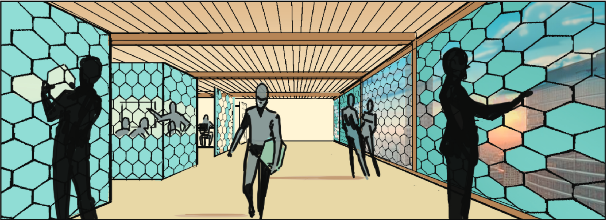
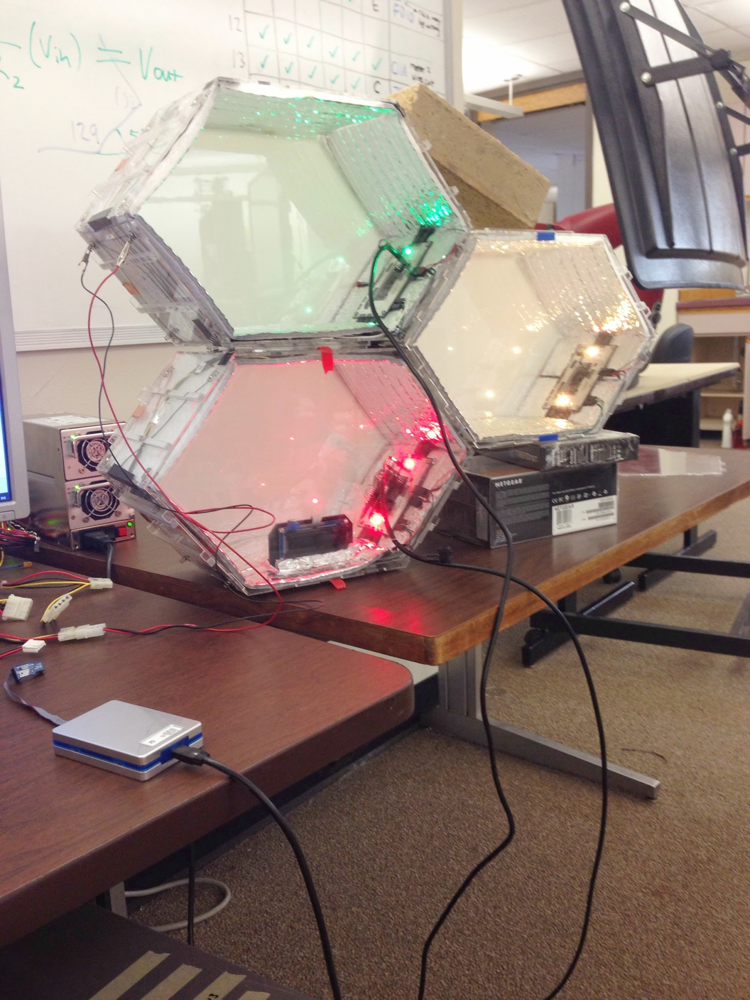
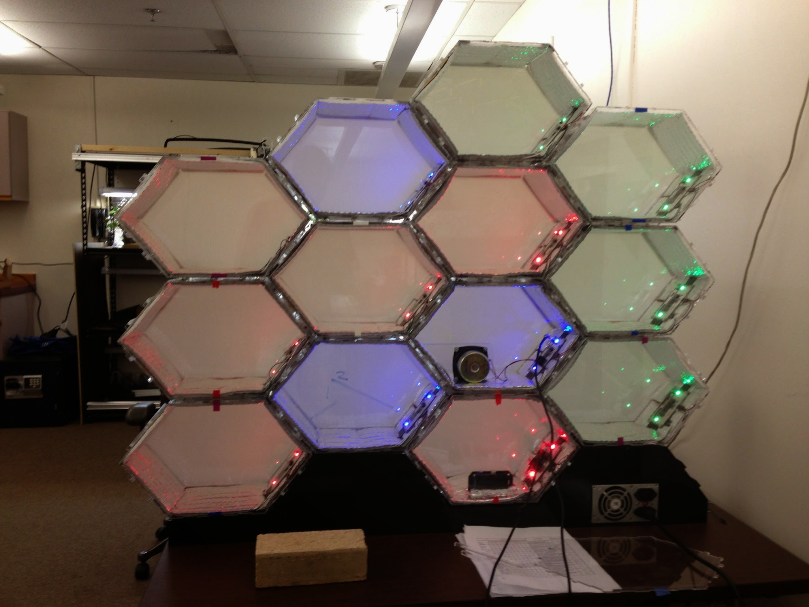
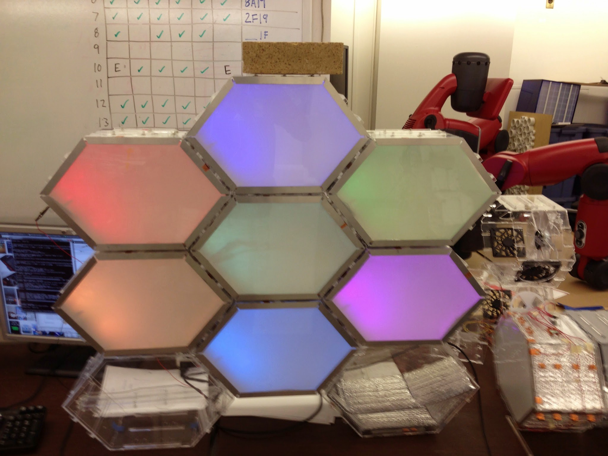
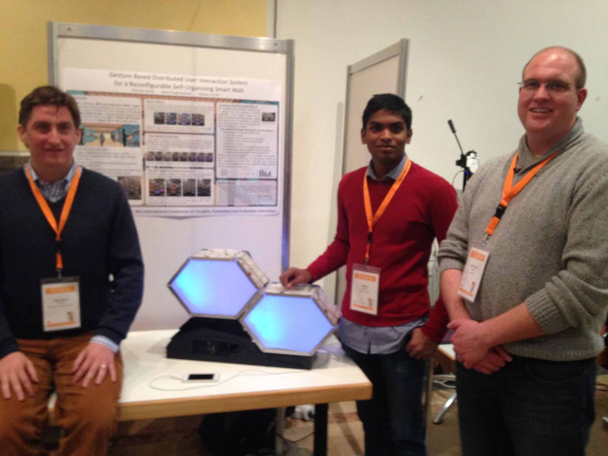

+++
title = "The Amorphous Facade and Developing a Gesture Based Decentralized User Interface"
description = "My first published work on developing user interfaces that span multiple independent nodes in communication in a smart wall"

[taxonomies]
tags = [ "distributed systems", "swarm robotics", "embedded systems", "hci", "design" ]
+++

For 2013 and 2014, I spent a good deal of my free time and all of my summer working on research in Swarm Robotics at the University of Colorado Boulder in Professor Nikolaus Correll's Lab. My main research interest was in exploring ways swarm robotics could be deployed to create new interesting interaction models.

> 
> Concept art for the Amorphous Facade

My work centered on a platform developed at Correll Lab called the Amorphous Facade; a concept for a modular smart wall where the "operating system" of the wall was completely decentralized and leveraged ad-hoc self-organization to do useful work. The idea is that you could build spaces out of the blocks were the intellegent features of the wall allowed you to manage enviormental conditions like lighting, HVAC, privacy and sound and also serve as display and control surface. Each block in the wall is embedded with a ATmega microcontroller, a sensor array, power systems, communication and LEDs. Each block was made out of acrylic, with an aluminum border which is sensitive to touch and a variable transparency faceplate which goes from opaque to clear when a voltage is applied.

> 
> Three blocks stacked, pins on the sides of the blocks facilitate power distribution and communication between blocks

The system becomes interesting because though the core functionality and software of the RTOS is identical from block to block, the blocks can have heterogenous hardware. So one block may be a camera block, another block may be use for HVAC or another could be for sound. Because of the networked nature of the system, capabilities can be shared and combined, for instance a single microphone block and a set of speaker blocks could be combined to create a loud speaker.

Because the system is required to be reconfigurable, the question of a decentralized user interface becomes important. Touch is a natural interaction medium for a wall. However, since the configuration of blocks could entirely different from one setup to another, in order to establish a usable touch wall, touches must be able to be put in context (i.e. we need to know where on the wall a touch was detected). We therefore need a way when the system starts up for blocks to establish their location relative to other blocks.

## Initialization of the Wall

Without localization, touch or any sort of multi-node display or action is impossible. The approach we used leverages the fact that each block is the same dimensions and that each block is created with a unique identifier. We designate a block the origin node (though in the implementation in the paper this is hard coded, a simple leader election algorithm would suffice to define the origin node of the network). The origin node first calculates the coordinates of its borders (where the touch sensors are). Then the origin node multicasts to the bordering blocks the calculated center of the border blocks in relation to its center. Each of these border nodes then does the same process, propagating localization through the network. The location setting message also includes a hop count so blocks will localized based on the message with the lowest hop count.

> 
> Blocks mid localization, different colors represent different states in the localization process.

Now that each block knows where it is in relation to others, it is now possible to start creating more interesting interfaces to leverage the features of the wall.

## Gesture Based Distributed User Interaction System for a Reconfigurable Self-Organizing Smart Wall

> See paper for full details: [Gesture Based Distributed User Interaction System for a Reconfigurable Self-Organizing Smart Wall](https://dl.acm.org/doi/pdf/10.1145/2540930.2540967)

At the time of the paper, there were a lot of potential functions that the wall could implement based on the sensors embedded in the control board. The wall can change transparency, it can act as a lighting system, a sound system, an HVAC system and a display.

All of these systems require user controls that are intuitive but also possible to be implemented within the network. The simplest technical solution is to have each block expose itself as the interface for the wall, using the six touch buttons as the input mechanism. The issue with this is that its is hard to convey useful information on a single block that can has no display.

A better solution is a multi-node system where a subset of the wall work together to expose a more useful interface.

### Establishing a Multi-node Interface

Since the system is distributed and there is no hierarchy in the system, the blocks must self organize to create the interface. The way we do this is when a user touches on of the blocks on the wall in an effort to accomplish a task, the block that was touched recruits the surrounding nodes to create a flower like menu system. At the time of the paper the menu functions are represented as colors, however when displays are integrated into the face of the block, the menu becomes more descriptive.

> 
> An example of the flower menu open, each color represents a different function for the wall.

A user can then select a function by sliding a block color into the center.

We then describe a set of interaction models to address various tasks.

### Interaction Models

#### Binary Settings

For binary settings (ON / OFF) we show a switch like interface where swiping from the bottom to the top or the top to the bottom flips the switch.

> 
> An interaction where flipping the binary switch makes the wall transparent instead of opaque

*A more intuitive interaction maybe to make a similar looking interface but in order to reflect device state, the current state is illuminated and the opposite state should be white. Then the user should just have to touch the block representing the state desired*

#### Granular Settings

For settings that have more granular controls than on or off, we describe a dial interface. The user swipes around the center block in a clockwise or counter-clockwise motion in order to increase or decrease the setting value.

> 
> An interaction where swiping around the dial increases the volume of the speaker

> Nicholas Farrow, Prof. Correll and I presenting our work at TEI 2014 in Munich