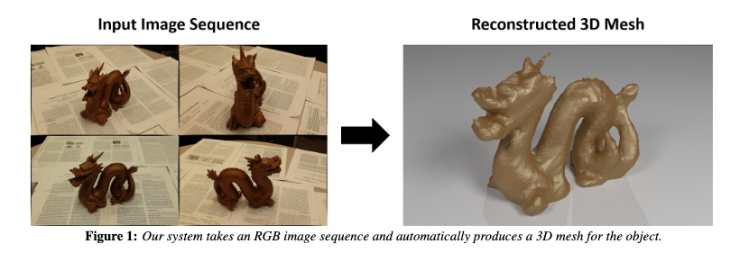
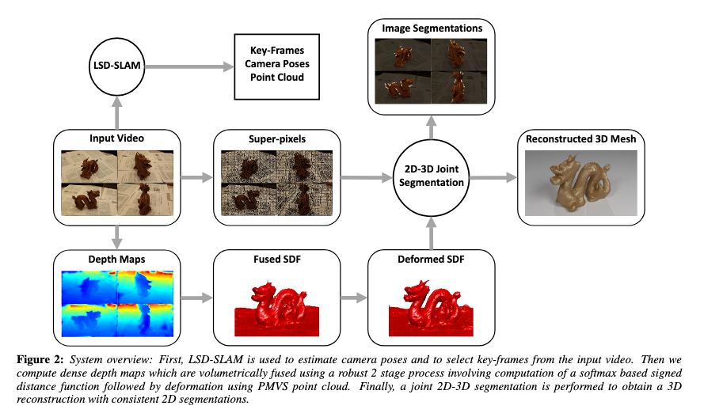
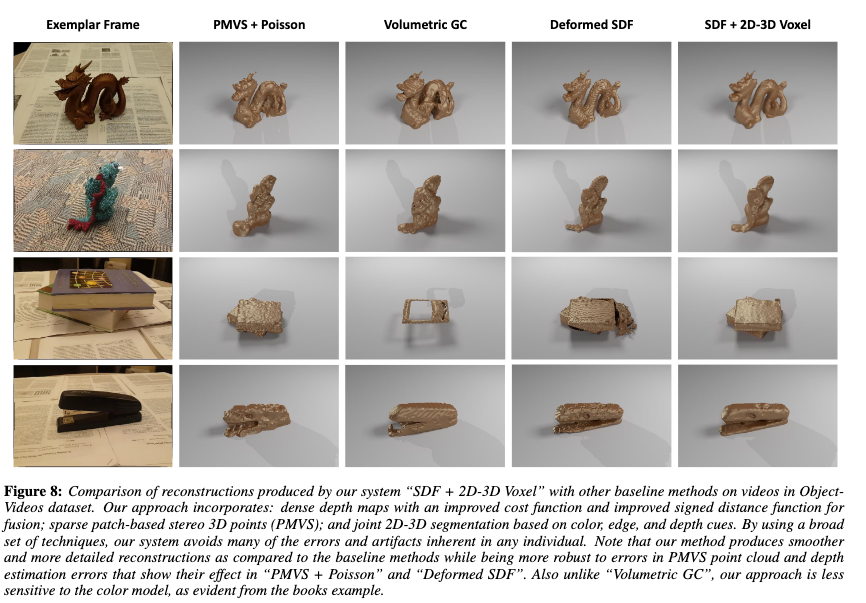

+++
title = "3DFS: Deformable Dense Depth Fusion and Segmentation for Object Reconstruction from a Handheld Camera"
description = "We propose an approach for 3D reconstruction and segmentation of a single object placed on a flat surface from an input video. Our approach is to perform dense depth map estimation for multiple views using a proposed objective function that preserves detail. The resulting depth maps are then fused using a proposed implicit surface function that is robust to estimation error, producing a smooth surface reconstruction of the entire scene. Finally, the object is segmented from the remaining scene using a proposed 2D-3D segmentation that incorporates image and depth cues with priors and regularization over the 3D volume and 2D segmentations. We evaluate 3D reconstructions qualitatively on our Object-Videos dataset, comparing to fusion, multiview stereo, and segmentation baselines. We also quantitatively evaluate the dense depth estimation using the RGBD Scenes V2 dataset [Henry et al. 2013] and the segmentation using keyframe annotations of the Object-Videos dataset. "

[taxonomies]
tags = ["cv", "cg"]
+++

> From video to 3D model automatically

During my time working in the UIUC Vision Group with Prof. Hoiem I worked on 3DFS (Deformable Dense Depth Fusion and Segmentation).
3DFS is a 3D reconstruction and segmentation system from standard video.

> The processing stages of 3DFS in order to go from video to object reconstruction and segmentation masks

Users can take a video filming different angles of an object,
3DFS then goes through four stages. First it uses LSD-SLAM to estimate camera poses in the video, select key frames, and produce
semi-dense depth maps. Then 3DFS conducts surface modeling to estimate dense depth maps. Next the depth maps are volumetrically
fused to create a function field that describes for each voxel the distance to the nearest surface. Because there is a bias in the initial
fusing, using the estimated camera poses and key frames from LSD-SLAM, we apply the Patch Based Multiview Stereo method which is able
to generate an accurate sparse point cloud of the surface of object and use that point cloud to refine the function field. Finally
3DFS conducts a joint segmentation of all the key frames and the voxel map using graph cuts. This gives us both the refined object
reconstruction and segmentation masks for the object.

> Reconstruction results (SDF + 2D-3D Voxel) compared against other methods

The reconstructions are pretty good and unlike other methods that are highly choreographed, with highly constrained filming conditions and using complex equipment or targeting easier to models objects to satisfy assumptions, 3DFS can be used by someone with their smartphone in standard
lighting conditions and is robust to material characteristics like low surface texture, complex shapes, and specular materials.

There are some limitations however. The main source of error in the system is the camera pose estimation from LSD SLAM which
effects both the construction of the depth maps and the accuracy of the PMVS point clouds. This is caused by significant occlusion
or changes in lighting mid video. There also may be errors due to the handheld nature of the video including out of focus frames.
Also though 3DFS does better than other methods when it comes to low surface texture and specularity, the errors from these
material characteristics still do effect reconstruction. These issues make it harder to model very flat objects for instance.
This method is also mostly targeted at small objects and so the choice of using a discreet voxel grid may hamper scalability
to much larger objects and we also assume that objects are on a flat planar surface so some amount of staging is required by the
user. Finally our method still fails to recover small geometric details which is still an open research problem.

There are cool applications for this technology. It enables almost anyone to become a 3D modeler without needing to know
CAD or modeling tools. This could let animators more quickly create 3D assets for films and games. It could be applied
in the world of augmented reality, letting people quickly move objects into the virtual world. One of most fun applications
to me is the potential to be able to quickly scan an object with your phone and then 3D print it right then and there,
an easy way to clone objects in the real world.

> You can read the full paper on 3DFS here: [https://arxiv.org/pdf/1606.05002.pdf](https://arxiv.org/pdf/1606.05002.pdf)
<iframe width="560" height="315" src="https://www.youtube-nocookie.com/embed/qP_uLYYBi70" frameborder="0" allow="accelerometer; autoplay; clipboard-write; encrypted-media; gyroscope; picture-in-picture" allowfullscreen></iframe>

