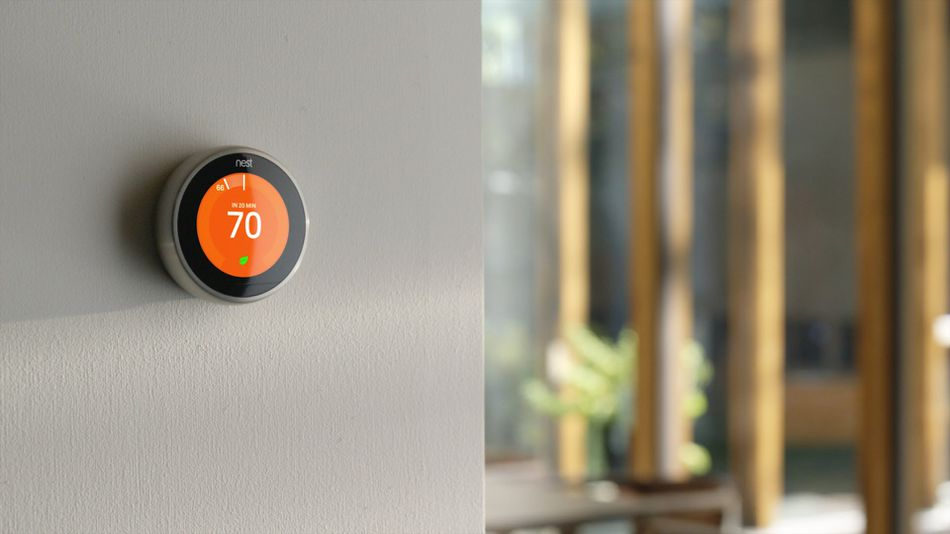
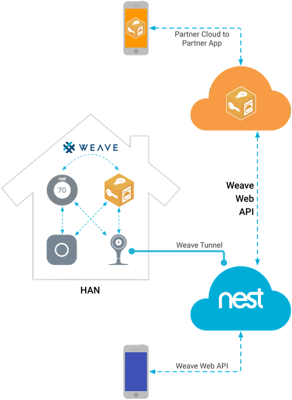
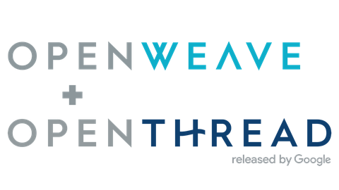

+++
title = "Weave DSL - A DSL for IoT Device specification"
description = "A DSL made by Nest Labs to easily develop end-to-end IoT services"

[taxonomies]
tags = ["embedded", "compilers", "open source"]
+++

## Weave



The potential of IoT in the mid 2010s was really embodied by Nest, a company founded by the same
people who developed the iPod and ultimately was bought by Google. Nest had focus
on elegant design and intelligent behavior and this was embodied best by the Nest Thermostat,
a small puck which at the time was completely different than anything on the market.
It not only looked different, it was truly smart, tracking usage and self programming to
make your home more comfortable and more efficient. As Nest branched out into other products
like smoke detectors and cameras, it started to think about how all these devices would work together.


Nest developed the Thread protocol which is like the low power, IoT version of WiFi. The idea is that
you don't want these devices to clog up the WiFi network and consume a lot of power doing so and instead
could run on a separate network which specializes in low energy operation. Also unlike WiFi, Thread
is mesh based, it creates a spanning tree across all devices and uses some devices to route to others.
This ensures that there is a stable connection for each IoT device. Nest wanted to center as much of the
information and decision making inside the Thread network as possible, instead of relying on a bunch of
cloud services needed to interact on your devices behalf. So they developed an application layer protocol
for Thread called Weave.



The role of Weave is to be the layer that allows structured information like requests for the current temperature
or the status of the smoke alarm can be transmitted. This is all done within the "Home Area Network" (HAN). The
issue is it becomes pretty complicated and time consuming to build complex features when you need to worry about
not just the device and Weave implementation but also the cloud services side to handle updates and remote access
and the UI on smart phones and the web.

###  Weave Schema Description Language

My internship work was to help address this problem. My team built into Weave a formalization of devices, called a device
schema. This is the data model for the device.

> "
> The schema defines three elements:
>  - Traits: A unit of basic capability, such as the state of a property, a notification of the state, or a request to change the state
>  - Interfaces:  A group of traits that represent a specific function, such as the properties and events that make up a deadbolt lock
>  - Resources: A logical or physical thing comprised of traits and interfaces, such as a Nest device, a structure, or a user
> "

So a user can define a light which has the trait whether its on or off, and an interface which is a command to turn it on or off and the light itself is the resource.

We define this formalism using the Weave Schema Description Language, a DSL which gives us a structured artifact that describes a device.

Here is an example schema of an interface that implements a door lock:

```proto
/*
 *
 *    Copyright (c) 2019 Google LLC.
 *    Copyright (c) 2016-2018 Nest Labs, Inc.
 *    All rights reserved.
 *
 *    Licensed under the Apache License, Version 2.0 (the "License");
 *    you may not use this file except in compliance with the License.
 *    You may obtain a copy of the License at
 *
 *        http://www.apache.org/licenses/LICENSE-2.0
 *
 *    Unless required by applicable law or agreed to in writing, software
 *    distributed under the License is distributed on an "AS IS" BASIS,
 *    WITHOUT WARRANTIES OR CONDITIONS OF ANY KIND, either express or implied.
 *    See the License for the specific language governing permissions and
 *    limitations under the License.
 */

/**
 *    @file
 *      This file specifies a Weave Common interface for a PIN
 *      code-actuated bolt lock.
 *
 */

syntax = "proto3";
package weave.iface.lock;

option java_package="weave.lock";
option java_outer_classname = "WeaveInternalPincodeLockIface";
option objc_class_prefix = "SCM";

import "wdl/wdl_options.proto";
import "weave/iface/lock/basic_lock_iface.proto";
import "weave/trait/security/bolt_lock_trait.proto";
import "weave/trait/security/bolt_lock_settings_trait.proto";
import "weave/trait/security/bolt_lock_capabilities_trait.proto";
import "weave/trait/security/user_pincodes_settings_trait.proto";
import "weave/trait/security/user_pincodes_capabilities_trait.proto";
import "weave/trait/schedule/basic_user_schedules_settings_trait.proto";
import "weave/trait/schedule/basic_user_schedules_capabilities_trait.proto";
import "weave/trait/security/pincode_input_trait.proto";
import "weave/trait/security/pincode_input_settings_trait.proto";
import "weave/trait/auth/application_keys_trait.proto";

message PincodeLockIface {
  option (wdl.message_type) = IFACE;
  option (wdl.iface) = {
    stability: ALPHA,
    vendor_id: 0x0000,
    version: 1
  };

  weave.trait.security.BoltLockTrait lock = 1;
  weave.trait.security.BoltLockSettingsTrait lock_settings = 2;
  weave.trait.security.BoltLockCapabilitiesTrait lock_capabilities = 3;

  weave.trait.security.UserPincodesSettingsTrait pincodes_settings = 4;
  weave.trait.security.UserPincodesCapabilitiesTrait pincodes_capabilities = 5;

  weave.trait.schedule.BasicUserSchedulesSettingsTrait schedules_settings = 6;
  weave.trait.schedule.BasicUserSchedulesCapabilitiesTrait schedules_capabilities = 7;

  weave.trait.security.PincodeInputTrait keypad = 8;
  weave.trait.security.PincodeInputSettingsTrait keypad_settings = 9;

  weave.trait.auth.ApplicationKeysTrait application_keys = 10;
  message Implements {
    option (wdl.message_type) = IFACE_IMPLEMENTATIONS;
    weave.iface.lock.BasicLockIface basic_lock = 1;
  }
}
```

You can see that for this lock interface there is a bunch of traits that describe states like the lock, its settings, the pincode etc.
Here is an implementation of the bolt lock trait:

```proto
/*
 *
 *    Copyright (c) 2019 Google LLC.
 *    Copyright (c) 2016-2018 Nest Labs, Inc.
 *    All rights reserved.
 *
 *    Licensed under the Apache License, Version 2.0 (the "License");
 *    you may not use this file except in compliance with the License.
 *    You may obtain a copy of the License at
 *
 *        http://www.apache.org/licenses/LICENSE-2.0
 *
 *    Unless required by applicable law or agreed to in writing, software
 *    distributed under the License is distributed on an "AS IS" BASIS,
 *    WITHOUT WARRANTIES OR CONDITIONS OF ANY KIND, either express or implied.
 *    See the License for the specific language governing permissions and
 *    limitations under the License.
 */

/**
 *    @file
 *      This file defines the Bolt Lock trait.
 *
 */

syntax = "proto3";

package weave.trait.security;

import "wdl/wdl_options.proto";
import "weave/common/identifiers.proto";
import "google/protobuf/timestamp.proto";

option java_outer_classname = "WeaveInternalBoltLockTrait";
option objc_class_prefix = "SCM";

/**
 * Residential Bolt Lock Trait is meant to cover a physical residential lock that uses a deadbolt as its locking mechanism.
 * Beyond its physical attributes, it is REQUIRED to have the following functionality:
 * - Retract/Extend Bolt remotely
 * - Retract/Extend Bolt locally
 * - Report the bolt state itself (i.e. Extended, Retracted, etc.  See BoltState for more info)
 * - Report the bolt actuator state (i.e. OK, Moving, Locking, Unlocking, etc.  See BoltActuatorState for more info)
 * - Report what caused the bolt state or actuator state to change (i.e. Inside, Outside, Outside Keypad.  See BoltBlame)
 *
 * Optionally, a lock may
 * - Report the locked state of the lock as a whole (i.e. Unlocked, Locked, etc.  See LockedState)
 *
 * V2 adds support for voice arming (via cloud)
 *
 * Scenarios:
 * - Bolt extended and locked, User retracts bolt w/a pin code
 *      1) Bolt begins retracting
 *      2) Notify
 *      actuator_state = BOLT_ACTUATOR_STATE_UNLOCKING
 *      locked_state = BOLT_LOCKED_STATE_UNLOCKED
 *      3) Event BoltActuatorStateChangeEvent
 *      state = BOLT_STATE_EXTENDED
 *      actuator_state = BOLT_ACTUATOR_STATE_UNLOCKING
 *      locked_state = BOLT_LOCKED_STATE_UNLOCKED
 *      blame = BOLT_BLAME_OUTSIDE_KEYPAD_PIN
 *      userid = someuserid of matching pincode
 *      4) Bolt retraction completes
 *      5) Notify
 *      state = BOLT_STATE_RETRACTED
 *      actuator_state = BOLT_ACTUATOR_STATE_OK
 *      6) Event BoltActuatorStateChangeEvent w/
 *      state = BOLT_STATE_RETRACTED
 *      actuator_state = BOLT_ACTUATOR_STATE_OK
 *      locked_state = BOLT_LOCKED_STATE_UNLOCKED
 *      blame = BOLT_BLAME_OUTSIDE_KEYPAD_PIN
 *      userid = someuserid of matching pincode
 *
 * - Bolt retracted and unlocked, User extends bolt w/one touch
 *      1) Bolt begins extending
 *      2) Notify
 *      state = BOLT_STATE_EXTENDED
 *      actuator_state = BOLT_ACTUATOR_STATE_LOCKING
 *      locked_state = BOLT_LOCKED_STATE_UNLOCKED
 *      3) Event BoltActuatorStateChangeEvent
 *      state = BOLT_STATE_EXTENDED
 *      actuator_state = BOLT_ACTUATOR_STATE_LOCKING
 *      locked_state = BOLT_LOCKED_STATE_UNLOCKED
 *      blame = BOLT_BLAME_OUTSIDE_MANUAL
 *      userid = <omitted>
 *      4) Bolt extension completes
 *      5) Notify
 *      actuator_state = BOLT_ACTUATOR_STATE_OK
 *      locked_state = BOLT_LOCKED_STATE_LOCKED
 *      6) Event BoltActuatorStateChangeEvent
 *      state = BOLT_STATE_EXTENDED
 *      actuator_state = BOLT_ACTUATOR_STATE_OK
 *      locked_state = BOLT_LOCKED_STATE_LOCKED
 *      blame = BOLT_BLAME_OUTSIDE_MANUAL
 *      userid = <omitted>
 *
 * - Bolt retracted and unlocked, User extends bolt w/mobile but does not lock
 *      1) Update w/metadata
 *          blame = BOLT_BLAME_REMOTE_USER
 *          userid = someuserid
 *      2) Bolt begins extending
 *      3) Notify
 *      state = BOLT_STATE_EXTENDED
 *      actuator_state = BOLT_ACTUATOR_STATE_LOCKING
 *      locked_state = BOLT_LOCKED_STATE_UNLOCKED
 *      3) Event BoltActuatorStateChangeEvent
 *      state = BOLT_STATE_EXTENDED
 *      actuator_state = BOLT_ACTUATOR_STATE_LOCKING
 *      locked_state = BOLT_LOCKED_STATE_UNLOCKED
 *      blame = BOLT_BLAME_REMOTE_USER
 *      userid = someuserid
 *      4) Bolt extension completes
 *      5) Notify
 *      actuator_state = BOLT_ACTUATOR_STATE_OK
 *      6) Event BoltActuatorStateChangeEvent
 *      state = BOLT_STATE_EXTENDED
 *      actuator_state = BOLT_ACTUATOR_STATE_OK
 *      locked_state = BOLT_LOCKED_STATE_UNLOCKED
 *      blame = BOLT_BLAME_REMOTE_USER
 *      userid = someuserid
 */
message BoltLockTrait {
  option (wdl.message_type) = TRAIT;
  option (wdl.trait) = {
    stability: ALPHA,
    id: 0x0E02,
    vendor_id: 0x0000,
    version: 2
  };

/**
   * The current state of the bolt itself
   * Remember, this only tells you the state of the bolt itself and doesn't tell you
   * anything about whether the door is locked (i.e. bolt is in jamb) or not.  To
   * get the full picture you must look to information represented by the LockedState enum
   *
   * Implementors of this trait must implement all values below
   */
  enum BoltState {
    BOLT_STATE_UNSPECIFIED = 0;
    BOLT_STATE_RETRACTED = 1;       /// Bolt is fully retracted
    BOLT_STATE_EXTENDED = 2;        /// Bolt is AT LEAST partially extended.
  }

  /**
  *
  * The method / UI interacting with the bolt lock
  * Depending on the method originator may or may not be available
  *
  */
  enum BoltLockActorMethod {
    BOLT_LOCK_ACTOR_METHOD_UNSPECIFIED = 0;

    /**
      * Change produced by an unspecified entity that doesn't fall into one of the defined categories below
      *  - Who may not be present
      *  - Expected to be correlated with an event
      */
    BOLT_LOCK_ACTOR_METHOD_OTHER = 1;

    /// On-device actor methods
    /**
      * Change produced by the physical interaction on the lock but with no PIN entered (Typically for locking or unlocking with the thumb turn)
      *  - Who MUST NOT be present
      */
    BOLT_LOCK_ACTOR_METHOD_PHYSICAL = 2;

    /**
      * Change produced by the physical keypad by typing in a PIN
      *  - Who MUST be present
      *  - Expected to be correlated with an event that represents "keypad pin entered successfully" (see PinCodeInputTrait for an example event)
      */
    BOLT_LOCK_ACTOR_METHOD_KEYPAD_PIN = 3;

    /**
      * Change produced by the device internally. For instance, if the device has a mechanisim to automatically lock
      * after a period of time.
      * - Who may not be present.
    */
    BOLT_LOCK_ACTOR_METHOD_LOCAL_IMPLICIT = 4;

    /// App actor methods
    /**
      * Change produced by a user using the app
      *  - Who may not be present
      */
    BOLT_LOCK_ACTOR_METHOD_REMOTE_USER_EXPLICIT = 5;

    /**
      * Change produced by a user with implicit intent
      * ex. Toggling structure mode with the app mode switcher
      *  - Who may not be present
      *  - Expected to be correlated with a structure mode change event?
      */
    BOLT_LOCK_ACTOR_METHOD_REMOTE_USER_IMPLICIT = 6;

    /**
      * Change produced by a user that does not fit in one of the
      * other app remote categories
      */
    BOLT_LOCK_ACTOR_METHOD_REMOTE_USER_OTHER = 7;

    /// Other actor methods
    /**
      * Change produced by a remote service with no user intent (ex: Goose)
      *  - Who may not be present
      *  - Expected to be correlated with an event (???)
      */
    BOLT_LOCK_ACTOR_METHOD_REMOTE_DELEGATE = 8;

    /**
      * Lock will (???) on its own before a critically low battery shutdown
      */
    BOLT_LOCK_ACTOR_METHOD_LOW_POWER_SHUTDOWN = 9;

    /**
      * Change produced through a voice assistant based surface
      */
    BOLT_LOCK_ACTOR_METHOD_VOICE_ASSISTANT = 10 [(wdl.enumvalue) = {compatibility: {min_version: 2}}];
  }

  /**
   * Common construction of 'blames'.
   * How an action was taken and by whom.
   *
   */
  message BoltLockActorStruct {
    option (wdl.message_type) = STRUCT;

    /// how an action was taken
    BoltLockActorMethod method = 1;

    /// originator of the action, if available
    weave.common.ResourceId originator = 2 [(wdl.prop) = {nullable: true}];

    // Resource that took action on behalf of the originator
    weave.common.ResourceId agent = 3 [(wdl.prop) = {nullable: true, compatibility: {min_version: 2}}];
  }

  /**
   * The current actuator state
   * Implementors of this trait must at a minimum be able to report:
   * - BOLT_ACTUATOR_STATE_OK
   * - BOLT_ACTUATOR_STATE_LOCKING
   * - BOLT_ACTUATOR_STATE_UNLOCKING
   * - BOLT_ACTUATOR_STATE_MOVING
   */
  enum BoltActuatorState {
    BOLT_ACTUATOR_STATE_UNSPECIFIED = 0;
    BOLT_ACTUATOR_STATE_OK = 1;         /// Actuator is not moving and is in a fully settled position.  If its not settled use BOLT_ACTUATOR_STATE_MOVING
    BOLT_ACTUATOR_STATE_LOCKING = 2;    /// Actuator is attempting to lock
    BOLT_ACTUATOR_STATE_UNLOCKING = 3;  /// Actuator is attempting to unlock
    /** Actuator is moving though it’s not necessarily clear the intended direction
     * This is typically used when the user is physically manipulating the bolt
     */
    BOLT_ACTUATOR_STATE_MOVING = 4;
    BOLT_ACTUATOR_STATE_JAMMED_LOCKING = 5;     /// Actuator jammed while the device was locking and cannot move.
    BOLT_ACTUATOR_STATE_JAMMED_UNLOCKING = 6;   /// Actuator jammed while the device was unlocking and cannot move.
    BOLT_ACTUATOR_STATE_JAMMED_OTHER = 7;       /// Actuator jammed and cannot move. The direction the lock was moving was not provided.
  }

  /**
   * The current locked state of the bolt lock as a whole
   * This state takes into account the resource's best ability to determine how physically secure
   * the resource is with respect to this bolt lock
   *
   * Implementors of this trait must at a minimum be able to report:
   * - LOCKED_STATE_UNKNOWN
   */
  enum BoltLockedState {
    BOLT_LOCKED_STATE_UNSPECIFIED = 0;
    /** The lock as a whole is not locked to the best knowledge of the implementor.
     * i.e. the door that this lock is attached to can be opened
     */
    BOLT_LOCKED_STATE_UNLOCKED = 1;
    /** The lock as a whole is locked to the best knowledge of the implementor.
     *  i.e. the door that this lock is attached to cannot be opened
     */
    BOLT_LOCKED_STATE_LOCKED = 2;
    /** The implementor is not able to determine whether the door is locked or unlocked.
     *  i.e. "Locked" sensing is based on a history of readings and that history is now gone or lost
     */
    BOLT_LOCKED_STATE_UNKNOWN = 3;
  }

  // ----------- PROPERTIES ----------- //

  option (wdl.properties) = {
    extendable: true,
    reserved_tag_min: 1,
    reserved_tag_max: 31
  };

  /// The current state of the bolt itself
  /// Remember this only tells you about the bolt state not about the locked state of the lock as a whole
  /// The lock as a whole is only fully secure if bolt_state == BOLT_STATE_EXTENDED AND locked_state == LOCKED_STATE_LOCKED
  ///
  /// If state == BOLT_STATE_RETRACTED
  /// - actuator_state must be BOLT_ACTUATOR_STATE_OK or BOLT_ACTUATOR_STATE_JAMMED
  /// - locked_state must be LOCKED_STATE_UNLOCKED or LOCKED_STATE_UNKNOWN
  /// If state == BOLT_STATE_EXTENDED
  /// - actuator_state may be any value
  /// - locked_state may be any
  BoltState state = 1;

  /// The current state of the bolt's actuator
  BoltActuatorState actuator_state = 2 [(wdl.prop) = {writable: READ_ONLY}];

  /// The current state of how secure the lock is as whole
  BoltLockedState locked_state = 3 [(wdl.prop) = {writable: READ_ONLY}];

  /// Describes who/what last caused the bolt actuator state to change and how they did it.
  /// Should be updated together whenever locked_state is changed, i.e. via BoltLockChangeRequest
  BoltLockActorStruct bolt_lock_actor = 4 [(wdl.prop) = {writable: READ_ONLY, nullable: true, ephemeral: true}];

  /// The time at which the lock state was changed.
  /// Updated together with locked_state
  google.protobuf.Timestamp locked_state_last_changed_at = 5 [(wdl.prop) = {writable: READ_ONLY,
                                                        timestamp_constraints: {signed: true,
                                                        precision: 0.001, width: 64},
                                                        nullable: true,
                                                        ephemeral: true}];

  // ----------- COMMANDS ----------- //

  /**
   * Command to request a change to bolt state
   * Should be used when with explicit or implicit user intent
   * Returns success when execution of the command has begun
   * Returns error if the command cannot be started
   */
  message BoltLockChangeRequest {
    option (wdl.message_type) = COMMAND;
    option (wdl.command) = {
      id: 0x01,
    };

    /// New requested state of the bolt
    BoltState state = 1;

    /// Describes who/what is sending the BoltLockChangeRequest and reason for the request.
    BoltLockActorStruct bolt_lock_actor = 4;
  }

  // ----------- EVENTS ----------- //
  /**
   * Event that is sent whenever actuator_state changes
   * See BoltLockActorMethod enum above for information on when to fill in "who" below and potential
   * correlated events
   */
  message BoltActuatorStateChangeEvent {
    option (wdl.message_type) = EVENT;
    option (wdl.event) = {
      id: 1,
      event_importance: EVENT_IMPORTANCE_PRODUCTION_CRITICAL
    };

    /// See BoltLockTrait for description
    BoltState state = 1;

    /// See BoltLockTrait for description
    BoltActuatorState actuator_state = 2;

    /// See BoltLockTrait for description
    BoltLockedState locked_state = 3;

    /// Describes who/what last caused the bolt actuator state to change and how they did it.
    /// Should be updated together whenever locked_state is changed, i.e. via BoltLockChangeRequest
    BoltLockActorStruct bolt_lock_actor = 4;
  }
}
```

You can see here the different things that the trait manages like the state of the bolt actuator and the user and sets out hooks for how to request that the
lock opens and closes.

The nice thing about the WDL language is that you can start to build out libraries of traits and interfaces that
can be reused and shared amongst developers.

My internship work was on the component which really makes Weave powerful, `wdlc`. `wdlc` let's users take a device schema and generate embedded C++ code
that will serve as the hooks for Weave to interface with the device. You can see here the code that gets generated from the schema.
```c++
/*
 *
 *    Copyright (c) 2019 Google LLC.
 *    All rights reserved.
 *
 *    Licensed under the Apache License, Version 2.0 (the "License");
 *    you may not use this file except in compliance with the License.
 *    You may obtain a copy of the License at
 *
 *        http://www.apache.org/licenses/LICENSE-2.0
 *
 *    Unless required by applicable law or agreed to in writing, software
 *    distributed under the License is distributed on an "AS IS" BASIS,
 *    WITHOUT WARRANTIES OR CONDITIONS OF ANY KIND, either express or implied.
 *    See the License for the specific language governing permissions and
 *    limitations under the License.
 */

#ifndef _WEAVE_TRAIT_SECURITY__BOLT_LOCK_TRAIT_H_
#define _WEAVE_TRAIT_SECURITY__BOLT_LOCK_TRAIT_H_

#include <Weave/Profiles/data-management/DataManagement.h>
#include <Weave/Support/SerializationUtils.h>


namespace Schema {
namespace Weave {
namespace Trait {
namespace Security {
namespace BoltLockTrait {

extern const nl::Weave::Profiles::DataManagement::TraitSchemaEngine TraitSchema;

enum {
      kWeaveProfileId = (0x0U << 16) | 0xe02U
};

//
// Properties
//

enum {
    kPropertyHandle_Root = 1,

    //---------------------------------------------------------------------------------------------------------------------------//
    //  Name                                IDL Type                            TLV Type           Optional?       Nullable?     //
    //---------------------------------------------------------------------------------------------------------------------------//

    //
    //  state                               BoltState                            int               NO              NO
    //
    kPropertyHandle_State = 2,

    //
    //  actuator_state                      BoltActuatorState                    int               NO              NO
    //
    kPropertyHandle_ActuatorState = 3,

    //
    //  locked_state                        BoltLockedState                      int               NO              NO
    //
    kPropertyHandle_LockedState = 4,

    //
    //  bolt_lock_actor                     BoltLockActorStruct                  structure         NO              YES
    //
    kPropertyHandle_BoltLockActor = 5,

    //
    //  method                              BoltLockActorMethod                  int               NO              NO
    //
    kPropertyHandle_BoltLockActor_Method = 6,

    //
    //  originator                          weave.common.ResourceId              bytes             NO              YES
    //
    kPropertyHandle_BoltLockActor_Originator = 7,

    //
    //  agent                               weave.common.ResourceId              bytes             NO              YES
    //
    kPropertyHandle_BoltLockActor_Agent = 8,

    //
    //  locked_state_last_changed_at        google.protobuf.Timestamp            int64 millisecondsNO              YES
    //
    kPropertyHandle_LockedStateLastChangedAt = 9,

    //
    // Enum for last handle
    //
    kLastSchemaHandle = 9,
};

//
// Event Structs
//

struct BoltLockActorStruct
{
    int32_t method;
    nl::SerializedByteString originator;
    void SetOriginatorNull(void);
    void SetOriginatorPresent(void);
#if WEAVE_CONFIG_SERIALIZATION_ENABLE_DESERIALIZATION
    bool IsOriginatorPresent(void);
#endif
    nl::SerializedByteString agent;
    void SetAgentNull(void);
    void SetAgentPresent(void);
#if WEAVE_CONFIG_SERIALIZATION_ENABLE_DESERIALIZATION
    bool IsAgentPresent(void);
#endif
    uint8_t __nullified_fields__[2/8 + 1];

    static const nl::SchemaFieldDescriptor FieldSchema;

};

struct BoltLockActorStruct_array {
    uint32_t num;
    BoltLockActorStruct *buf;
};

inline void BoltLockActorStruct::SetOriginatorNull(void)
{
    SET_FIELD_NULLIFIED_BIT(__nullified_fields__, 0);
}

inline void BoltLockActorStruct::SetOriginatorPresent(void)
{
    CLEAR_FIELD_NULLIFIED_BIT(__nullified_fields__, 0);
}

#if WEAVE_CONFIG_SERIALIZATION_ENABLE_DESERIALIZATION
inline bool BoltLockActorStruct::IsOriginatorPresent(void)
{
    return (!GET_FIELD_NULLIFIED_BIT(__nullified_fields__, 0));
}
#endif
inline void BoltLockActorStruct::SetAgentNull(void)
{
    SET_FIELD_NULLIFIED_BIT(__nullified_fields__, 1);
}

inline void BoltLockActorStruct::SetAgentPresent(void)
{
    CLEAR_FIELD_NULLIFIED_BIT(__nullified_fields__, 1);
}

#if WEAVE_CONFIG_SERIALIZATION_ENABLE_DESERIALIZATION
inline bool BoltLockActorStruct::IsAgentPresent(void)
{
    return (!GET_FIELD_NULLIFIED_BIT(__nullified_fields__, 1));
}
#endif
//
// Events
//
struct BoltActuatorStateChangeEvent
{
    int32_t state;
    int32_t actuatorState;
    int32_t lockedState;
    Schema::Weave::Trait::Security::BoltLockTrait::BoltLockActorStruct boltLockActor;

    static const nl::SchemaFieldDescriptor FieldSchema;

    // Statically-known Event Struct Attributes:
    enum {
            kWeaveProfileId = (0x0U << 16) | 0xe02U,
        kEventTypeId = 0x1U
    };

    static const nl::Weave::Profiles::DataManagement::EventSchema Schema;
};

struct BoltActuatorStateChangeEvent_array {
    uint32_t num;
    BoltActuatorStateChangeEvent *buf;
};


//
// Commands
//

enum {
    kBoltLockChangeRequestId = 0x1,
};

enum BoltLockChangeRequestParameters {
    kBoltLockChangeRequestParameter_State = 1,
    kBoltLockChangeRequestParameter_BoltLockActor = 4,
};

//
// Enums
//

enum BoltState {
    BOLT_STATE_RETRACTED = 1,
    BOLT_STATE_EXTENDED = 2,
};

enum BoltLockActorMethod {
    BOLT_LOCK_ACTOR_METHOD_OTHER = 1,
    BOLT_LOCK_ACTOR_METHOD_PHYSICAL = 2,
    BOLT_LOCK_ACTOR_METHOD_KEYPAD_PIN = 3,
    BOLT_LOCK_ACTOR_METHOD_LOCAL_IMPLICIT = 4,
    BOLT_LOCK_ACTOR_METHOD_REMOTE_USER_EXPLICIT = 5,
    BOLT_LOCK_ACTOR_METHOD_REMOTE_USER_IMPLICIT = 6,
    BOLT_LOCK_ACTOR_METHOD_REMOTE_USER_OTHER = 7,
    BOLT_LOCK_ACTOR_METHOD_REMOTE_DELEGATE = 8,
    BOLT_LOCK_ACTOR_METHOD_LOW_POWER_SHUTDOWN = 9,
    BOLT_LOCK_ACTOR_METHOD_VOICE_ASSISTANT = 10,
};

enum BoltActuatorState {
    BOLT_ACTUATOR_STATE_OK = 1,
    BOLT_ACTUATOR_STATE_LOCKING = 2,
    BOLT_ACTUATOR_STATE_UNLOCKING = 3,
    BOLT_ACTUATOR_STATE_MOVING = 4,
    BOLT_ACTUATOR_STATE_JAMMED_LOCKING = 5,
    BOLT_ACTUATOR_STATE_JAMMED_UNLOCKING = 6,
    BOLT_ACTUATOR_STATE_JAMMED_OTHER = 7,
};

enum BoltLockedState {
    BOLT_LOCKED_STATE_UNLOCKED = 1,
    BOLT_LOCKED_STATE_LOCKED = 2,
    BOLT_LOCKED_STATE_UNKNOWN = 3,
};

} // namespace BoltLockTrait
} // namespace Security
} // namespace Trait
} // namespace Weave
} // namespace Schema
#endif // _WEAVE_TRAIT_SECURITY__BOLT_LOCK_TRAIT_H_
```
In addition to generating the embedded core, the compiler will also generate the cloud services
code that will allow the cloud to interface with a device in the HAN via a Thread/WiFi Border Router, a device that will
be both on the WiFi and Thread networks and serving as a bridge between the two. Finally, the compiler can also
generate the Swift and Java code to hook the interfaces defined in the schema to UIs in a mobile app. For Nest this means
that for any device they create or a partner creates they just need to have the Weave Schema and the actual device to
fully integrate a new device into the Weave Network and show up in the Nest App. No frontend, or cloud development needed.
This lets developers focus on the device itself and less on the infrastructure.

To show off my work, I created a couple Weave devices on
top of Nest's internal development platform. This device simulated a door lock, turning an LED on and off when the user tries to unlock or lock the device.
I by myself was able to write the embedded code, and stand up a full end to end smart lock service integrated into the existing
Nest app in less than a week.

Weave is a strong choice for the protocol that will truly unify IoT ecosystems. Weave has the potential not just to make device
implementation easy but also could allow developers to make virtual devices. Developers could say describe an intercom system which in
might use a microphone and speakers. You could setup a weave device schema which says for the intercom interface you need a microphone trait and
multiple speaker traits. Then some physical device could query the HAN to find some devices that have a speaker trait or a mic trait then recruit them
to come together in this new intercom virtual device. So you could use the microphone on a Nest Cam and the speakers in Nest smoke detectors and
now have an in house intercom system without needed to buy any new hardware.

Nest was and Google is now committed to opening up weave to all sorts of developers by open sourcing Weave, WDL and the WDL compiler. Nest also open sourced Thread.
Thread has been adopted by companies like Eero / Amazon and Apple so maybe OpenWeave will come next.



- WDL Compiler: [https://github.com/openweave/openweave-wdlc](https://github.com/openweave/openweave-wdlc)
- OpenWeave: [https://github.com/openweave](https://github.com/openweave)
- OpenThread: [https://github.com/openthread](https://github.com/openthread)