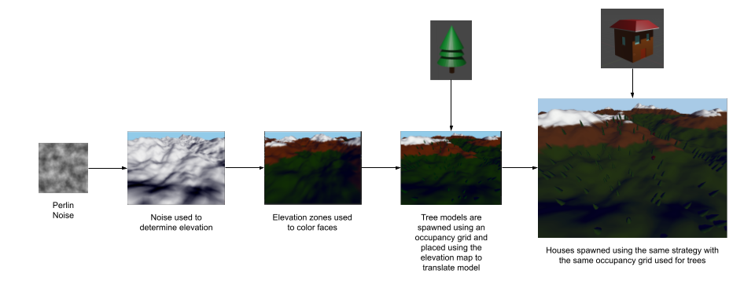
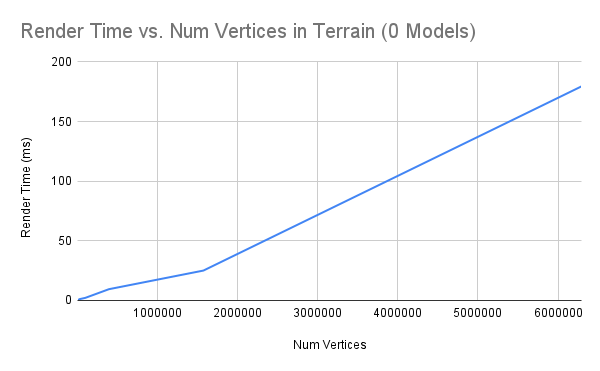
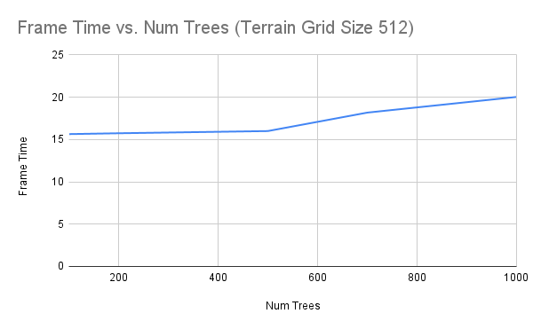

+++
title = "procgen-terrain: A Procedurally Generated Mountain Town"
description = "Exploring graphics in Rust with Vulkan and Vulkano"

[taxonomies]
tags = ["cg", "pcg", "rust"]
+++

### A Procedurally Generated Mountain Town

I spent the fall learning about computer graphics and OpenGL, a topic which I didn't get to cover in my undergrad. OpenGL is now a 30 year old standard which is primarily written in C/C++. It is a nice way to start since a lot of the common components needed in a graphics stack are baked in. But its usage patterns and APIs are showing their age so I wanted to see what next generation tools like Rust and Vulkan can allow me to do and to see what the differences are between the two stacks.


## Approach

Vulkan is a new low level graphics API that is intended as the next generation OpenGL. OpenGL being created in 1992 was designed for very different hardware paradigms. Over the last 3 decades the architecture and roles of the graphics card, driver and APIs have changed and Vulkan is intended to address these changes.

Similarly, when OpenGL was created C and C++ were the primary languages used to develop graphics applications. While they remain to be wildly popular, a new generation of programing languages are reaching maturity. These languages offer many modern convinces not reflected in C/C++ programming like a language specific build system and package manager, modules, and many compiler features to catch errors. One of the most exciting next generation programming languages is Rust which is a C-Like low level systems programming language with guaranteed memory and thready safety. Features that are of particular interest in graphics programming.

To try these new tools out I implemented a procedurally generated scene, where the terrain is generated from perlin noise. I then place models of trees and houses on to the terrain, randomly placed.

### Vulkan Pipeline Setup

There is a lot to do to setup a Vulkan Rendering Pipeline. In Rust there are a few choices for Vulkan API implementations. Some like [ash](https://github.com/MaikKlein/ash) are very lightweight and close to the original C++ implementation. However, these sort of APIs are "unsafe" meaning you lose many of the benefits of using Rust in terms of memory
and thread safety in exchange for a very familiar interface. I chose [vulkano](https://github.com/vulkano-rs/vulkano). Vulkano is a "Rusty" implementation of Vulkan in that the coding paradigms used are native to Rust and it is fully compliant with "safe" Rust.

To actually set up a Vulkan renderer you need to construct all the parts of the OpenGL state machine which existed globally in OpenGL. This starts with the Vulkan Instance. The instance manages the version of the Vulkan spec we are using and any extensions to Vulkan we need to use. Window drawing is in fact not part of the core Vulkan spec, so this is one of the extensions we need to include.

In Rust the render loop is encapsulated in an EventLoop which defines enums for different events that can happen like key presses or window resizes. The actual render loop logic is defined in closure provided to the event loop.

The render image is called a surface. I actually use a different package `winit` to create this surface since its not a core part of Vulkan.

Next, we need to set up the device to render on. This starts by defining the set of extensions our device needs to support. All we need is a device that supports swapchains so we can draw onto the surface. Then we need to find a compatible device. Vulkano lets you list all available Vulkan capable devices (including software based Vulkan devices) and query if they support the necessary extensions. In my code there is logic to prefer the dGPU over the iGPU in the case there both.

After selecting the physical device (in my case my RTX 3050Ti) we need to create a Vulkan device. We base it off the physical device selected and provide a list of the features we need to have support for. In this case just swapchain support is needed. As a result of this process, queues are creates as well. Vulkan can support multiple queues but I only use one.

Next we actually create the swapchain which manages the image buffers. Swapchains allow you to construct the next frame while the current frame is being shown. The swap chain buffer size is window size dependent so the swap chain must be recreated if the window is resized.

We then create the render pass. Vulkan lets you have more than one render pass which can be used to apply multiple sets of vertex and fragment shaders. This is useful to isolate effects like lighting in their own passes. Passes can also multiple sub passes. In my application I only use a single pass similar to OpenGL code. The render pass defines as well the where the output of the graphics pipeline will go, the layout of the images and where the depth, color and stencil information will go.

From there we create the graphics pipeline. This is similar to the OpenGL program but contained and it provides more control. You provide the pipeline builder the layout of your input. the input shader, the format of the buffer, the viewport, the fragment shader and the render pass. This part is where Rust starts the shine. Macros in Rust are much more powerful than in C/C++. They let you execute code at compile time as well as create new code. This lets you do all sorts of powerful things. For example I can write my shaders and provide them to a rust macro. This macro can compile my shader at compile time and create a rust struct which corresponds to the input layout of my shader. This means I can set uniform buffers by just setting fields in a struct. I can also use another macro which takes my definition of a vertex and automatically structures the buffer to interface properly with my shader. Therefore I can just provide a vector of vertex structs and have Rust generate the code to lay it out. The compile will also throw errors if you improperly populate the buffers.

The last step is to allocate the framebuffers for the swapchain. We launch the event loop to start the rendering.

The closure in the event loop defines the render logic. Rust enforces that all cases be handled, so you need to define a way to handle each event. Most will fall into a default case. In this default case, the first thing to do is clean the last frame so that memory does not leak. Then it is important to check if the swap chain needs to be rebuilt. This can be due to the window being resized or Vulkan can tell you when the swapchain is not optimal.

The next step is to get the next framebuffer we can draw on which we clear. From this point the pipeline is similar to OpenGL. You carry out a series of draw commands to render components of the scene. However in Vulkano this is done via a command builder. The command builder allows you to sequence a list of operations to run during the render pass. This is where pipelines and vertex buffers are bound and draw commands are issued. Once the pass is closed the command is built and then executed returning a "Future". Futures are a placeholder of something to happen in the future. It lets the main program continue executing and checking later for a result. This future will tell the program if the frame rendered successfully.


### Scene Pipeline


> The graphics pipeline to generate terrain and then place models

When the application starts the user can provide the following settings:

```
procgen-terrain 0.1.0

USAGE:
    procgen-terrain.exe [OPTIONS]

FLAGS:
        --help       Prints help information
    -V, --version    Prints version information

OPTIONS:
    -b, --bounds <bounds>         [default: 30]
    -g, --gridsize <gridsize>     [default: 256]
    -h, --houses <houses>         [default: 10]
    -m, --map <map>               [default: 128.0]
    -n, --noise <noise>           [default: 512]
    -s, --seed <seed>             [default: 100]
    -t, --trees <trees>           [default: 200]
```

- `noise`: Control the size of the noise map ($N \times N$) that is generated. This allows you to control the resolution of the noise
- `map`: Size ($M \times M$) of the terrain mesh generated in world coordinates
- `gridsize`: The resolution ($G \times G$) of the terrain mesh. Higher numbers mean more vertices in the mesh
- `seed`: The seed for the noise generator. Giving the same seed generates the same noise map
- `bounds`: The distance from the center that modeled geometry can spawn. Prevents unnecessary rendering for models that can't be seen
- `trees`: Number of trees to spawn. Trees are spawned in random positions on the terrain within the bounds
- `houses`: Number of houses to spawn. Like trees houses are spawned in random positions within the bounds

Using the noise seed, a perlin noise map is generated. A flat surface of $S \times S$ vertices is created spanning the space $M \times M$ in world coordinates. Using the noise map the intensity of a pixel in the map is used to set the $y$ coordinate by mapping each vertex from grid space into the dimensions of the noise map. Now the geometry of the terrain is set. In order to set the colors, bands of elevation are mapped to each material (Grass, Rock, Snow). At this point the terrain is complete. At the terrain creation stage, a $G \times G \times 3$ elevation map is created which stores the position of each vertex for later.

The bounds argument defines a $B \times B$ area in the scene centered on the origin where models can be rendered. This is done since far off parts of the terrain mesh will never have enough resolution to see the models. The scene pipeline samples $T$ locations for trees and $H$ locations for houses without replacement. The geometry and textures for the tree model and house models are loaded and initially scaled. Only one copy of the tree and house geometry are on the GPU but $T$ and $H$ copies of the model matrix are created to define the transformation for each tree to be rendered. Using the sampled locations to index the elevation map to get the $xyz$ position of the vertex that the model will be rendered on. The model is then translated to that position which makes it seem like the model is rendered on the surface of the terrain. During draw calls only the model matrix is changed between models, the model vertices never change.

## Rust/Vulkan vs C++/OpenGL

### The performance of Vulkan

I profiled my application using NVIDIA NSight Graphics which can profile both the CPU and GPU usage as well as the latency for each draw call and bottlenecks in shader execution.

In my profiling I found there is negligible CPU overhead once rendering begins on the order of < 0.1 ms. Since this was a design goal of Vulkan in improving over OpenGL and its heavy driver this is cool to see.

Using default settings I found that the terrain draw call took 9.41ms to draw. Default settings produce a 393216 vertex terrain model and is by far the most complex piece of geometry in the scene. The tree and house models each take 0.2ms and 0.1ms respectively per model to draw. They are 930 and 534 vertex models respectively.

With default settings I get a frame rate of on average 64 FPS on an RTX 3050 Ti. There are 211 draw calls per render pass. I also found that the frame rate fluctuates due to the complexity of the terrain in frame more an any number of models that get spawned.



In profiling the terrain rendering system you see linear scaling in the time to render the terrain model with the number of vertices in th the model which is to be expected.



In the measure of the impact of the number of models in the scene I found initially, up to 500, there is not a huge impact in frame times, the long pole is the terrain rendering. but there is a cross over point around 600 trees where the number of models becomes the main contributor to additional frame latency.

#### Performance Improvements

I currently only keep one copy of the models, Terrain, Tree and House on the GPU and just swap out the uniform buffers for the draw calls. I could try to find a way to reduce the upload time, maybe through pipelining or a swap buffer. This would reduce GPU memory bandwidth consumption and latency. I think that rendering gets held up on terrain for reasonable amounts of models. One of the new things Vulkan enables is multi-threaded rendering. So while the terrain is being drawn, I can draw the other geometry. Rust is also known for its thread safety so this seems like a good pair.


### How Vulkan and Rust compare to OpenGL and C++

There are stark differences between Vulkan and OpenGL. Vulkan gives you control over *everything*. This is both good and bad. The good is that you fully understand all aspects of the system and can customize it to the exact render architecture you would like. The bad is that there is a lot of set up. Vulkan also is not a "batteries included" Graphics API. Functionality other stacks deem core like windowing are extensions in Vulkan. Vulkan also still has some confusing and incomplete support in the ecosystem as it is still pretty new. Sometimes you get odd features being reported as unsupported.

All this being said, I think the way to look at Vulkan in contrast to OpenGL is that OpenGL is a framework for graphics applications. The majority of the effort is in formatting your data in a way that is consumable by OpenGL. Vulkan is a toolkit. The expectation is that you use the components in Vulkan to create something tuned to your specific application. You have direct control of the state of the graphics pipeline vs. managing a global state machine and all state modifications are in a self contained environment allowing you to manage more than one. This also enables multi-threaded rendering. Overall, this means you need to spend the time up front setting up a renderer but you can make sure that it fits the data you have ideally.

Vulkan is also more lightweight and has much better performance than OpenGL which is a clear decision maker in graphics. It allows you finer tuned control of the memory management to make resource management more efficient. Multi-threading is possible and commands take less time with less CPU overhead.

I also think that a strong positive or Vulkan is just that it is modern. OpenGL being written in the 90s lacks the last 20 years of evolution in programming paradigms. Functional programming, closures, advanced compiler support, types, descriptive error messaging and more are nonexistent in OpenGL where as in Vulkan through Vulkano, all these concepts are included and leveraged to help you develop applications.

This leads into the benefits of Rust. Where as I would be more tempered in my recommendation of Vulkan as a tool to use if you know what you want. I 100% recommend Rust over C++. The developer velocity during this project in contrast to the previous assignments is an order of magnitude greater. It is much easier to leverage the community who have put work into mesh file loaders, noise generators, ndarray implementations and graphics math libraries. Code is portable out of the box with little to no setup. It took me 5 mins on Windows to setup an environment to build the project which I built in Linux and it worked on the first try.

The community work and tooling alone is a strong enough reason to use Rust. But really what sets it apart are the language features and compiler. Macros in Rust remove 90% of boilerplate code. They let you generate linkages between shaders, CPUAccessibleBuffers and Structs in 5 lines of code, not to mention auto derived print formatting for debugging and copy constructors. Rust as a through its syntax gives you the freedom to solve problems in the way that feels most natural. In some cases functional map, filter, reduce pipelines make a lot of sense, like processing a lot of vertices in a vector. Other times for loops make sense. Tagged enums make it easy to encode information and create state machines which get enforced by the compiler. The intelligence of the compiler, the rules the language imposes and how strictly they are enforced also means that you get the performance of C with the memory safety of Java. If your code compiles, likely it will work in a safe manner. You pay the cost in terms of time to get code compiling but you spend far less time battling runtime bugs which are far harder to debug. The biggest concern of many beginning Rust programmers, the borrow checker gets addressed by Rust's wonderful compiler which unlike GCC not only provides relevant error messages but also suggests useful solutions. Many times the only thing needed to solve the borrow checker is just paste in the code that the compiler tells you to.

There are drawbacks for Rust though that I found. The main one is that there are 10 different alpha stability solutions for each problem which do 80% of what you need. Each dependency uses a different approach. So in my application I have 3 different glm like libraries which are good at slightly different things. This is just due to the ecosystem not solidifying common solutions like Python did with NumPy or PyTorch. I believe this is just a matter of time.

Overall, I had a really positive experience switching from OpenGL and C++ to Vulkan and Rust. I think that Vulkan is a little too low level for most small hobbyist scale projects but as soon as you move to build a real world system it is the clear choice. I think that there is space for something to provide a batteries included version of Vulkan. In Rust, the wgpu project might be this solution. I think that Rust on the otherhand enables developers to do more faster and provided the foundational dependencies needed for a project exist, there are very few reasons to use C/C++ over Rust.

You can find the implementation of this pipeline at: [https://github.com/narendasan/procgen-terrain](https://github.com/narendasan/procgen-terrain)