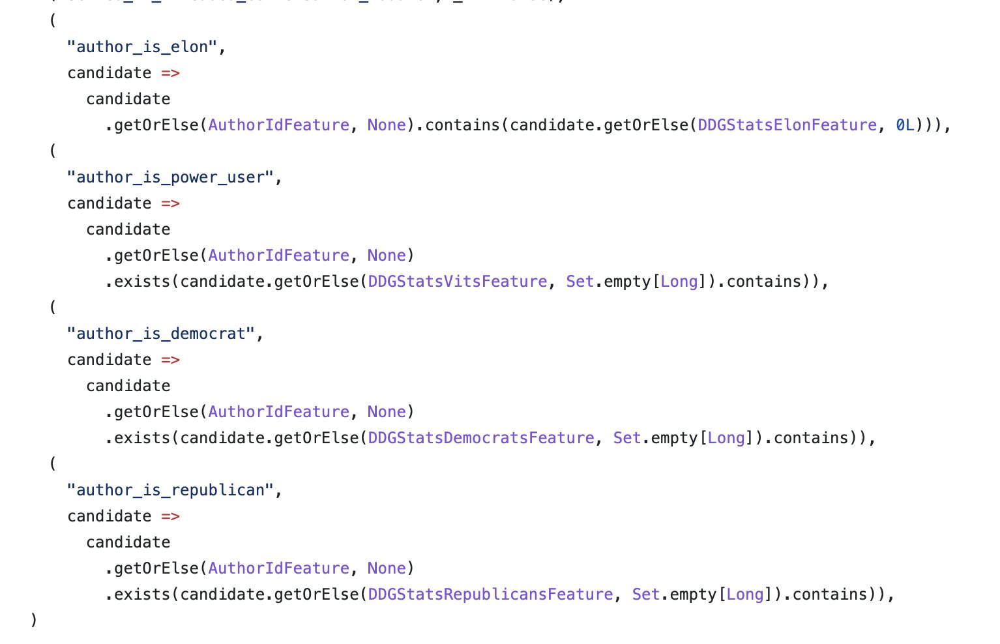
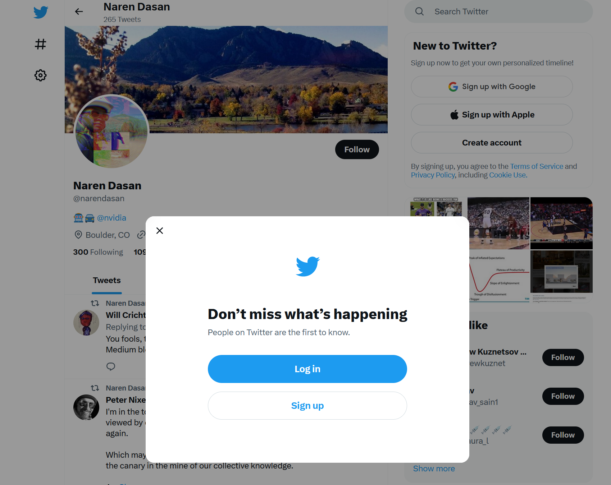

+++
title = "All Recommendation Engines Should Follow Twitter's Example on Transparency"
description = "Twitter released the source for its recommendation engine to be transparent about what it promotes and suppresses. Others should be required to do the same."

[taxonomies]
tags = ["commentary"]
+++

This week has been weird to say the least. We have fringe figures in the artificial intelligence community publishing opinions in Time Magazine on [the need to take violent action to stop the propagation of large language models](https://time.com/6266923/ai-eliezer-yudkowsky-open-letter-not-enough/), but I thought the most important story was [Elon Musk and Twitter releasing the source code for their Tweet recommendation system](https://blog.twitter.com/engineering/en_us/topics/open-source/2023/twitter-recommendation-algorithm).

I'm going to keep referring to this thing as a system or engine. I refuse to call it an algorithm. There are no strong guarantees associated with these systems, they mostly boil down to a collection of heuristics. Calling them an algorithm bastardizes the meaning of the term.

 

There's a lot of reasons to be tired of hearing about Twitter and Elon Musk. Twitter is a navel-gazy self important subculture full of "niche internet celebrities" being toxic to each other in one way or another. And Elon oscillates from being out of touch to down right unhinged depending on the hour. However, Twitter and other social media platforms for many, and particularly many who occupy other places of influence in society, serves as their primary lens on the state of the world. Many measure importance of issues, people, ideas etc. based on the traction they garner on these platforms. Therefore, it matters how and why some things are widely promoted and somethings are suppressed.

When Twitter released the source, Elon put out the following Tweet.

<blockquote class="twitter-tweet">
Most of the recommendation algorithm will be made open source today. The rest will follow.  Acid test is that independent third parties should be able to determine, with reasonable accuracy, what will probably be shown to users.  No doubt, many embarrassing issues will be… <a href="https://t.co/41U4oexIev">https://t.co/41U4oexIev</a>
&mdash; Elon Musk (@elonmusk) <a href="https://twitter.com/elonmusk/status/1641874582473695246?ref_src=twsrc%5Etfw">March 31, 2023</a></blockquote> 

I do not care what your opinion of him or his actions were, the stated goal _"[T]hat independent third parties should be able to determine, with reasonable accuracy, what will probably be shown to users"_ is a great one and should become the industry standard if not required by law to operate a walled (more on this caveat later) hosted consumer internet service.

The choices these systems make deeply influence society. [Revolutions](https://en.wikipedia.org/wiki/Social_media_and_the_Arab_Spring), political movements, [conspiracy theories](https://iiasa.ac.at/news/oct-2022/why-do-covid-19-conspiracy-theories-persist-on-social-media) all have been amplified or suppressed based on the opaque decisions of private actors and have effected billions of people with their actions. We do not know to what extent the Arab Spring, [Black Lives Matter](https://www.pewresearch.org/internet/2016/08/15/the-hashtag-blacklivesmatter-emerges-social-activism-on-twitter/), various COVID-19 related conspiracies have been enabled and "unnaturally" propagated or suppressed due to the operation of these recommendation systems. How would [ethinic relations in South Asia](https://www.nytimes.com/2018/04/21/world/asia/facebook-sri-lanka-riots.html) look without content recommendation systems mediating what people see? We have no idea if the stated values of platforms match what they recommend, all we get is little boxes on hot-button issues and handed down judgments from [unaccountable panels](https://techcrunch.com/2019/01/28/facebook-drafts-a-proposal-describing-how-its-new-content-review-board-will-work/)

This issue applies past the realm of social media. Models control [access to credit](https://www.nclc.org/resources/past-imperfect-how-credit-scores-and-other-analyticsbake-in-and-perpetuate-past-discrimination/), [access to health care](https://www.science.org/doi/10.1126/science.aax2342), [hiring decisions](https://www.hirevue.com/blog/train-validate-re-train-how-we-build-hirevue-assessments-models) and [entrance into elite institutions](https://www.brookings.edu/research/enrollment-algorithms-are-contributing-to-the-crises-of-higher-education/). Most of these systems are entirely black-box. The source data is not available and the modeling is not available. Yet we let these things make meaningful decisions in society.

We get some information from [company blog posts](https://about.instagram.com/blog/announcements/shedding-more-light-on-how-instagram-works) and [leaks](https://www.washingtonpost.com/technology/interactive/2021/how-facebook-algorithm-works/). But, many try to divine the incentives these models encode in a way reminiscent of a priest trying to divine the will of the Gods. Some say all that matters is engagement - just things that make you feel a strong emotion. Others say that these models try to recommend things that are easy to advertise against. People's livelihoods are tied to trying to figure out what will be most favored by the ["Algorithm"](https://www.youtube.com/watch?v=ogzsDTBh1T0). However, code is code, and with the release people have taken to searching through and trying to glean insights.

<blockquote class="twitter-tweet">
Twitter revealed its algorithm to the world.   But what does it mean for you?  I spent the evening analyzing it.  Here’s what you need to know:
&mdash; Aakash Gupta 🚀 Product Growth Guy (@aakashg0) <a href="https://twitter.com/aakashg0/status/1641976869460275201?ref_src=twsrc%5Etfw">April 1, 2023</a></blockquote> 

<blockquote class="twitter-tweet">
Twitter just open-sourced their algorithm.  Some initial takeaways: ◆ Your following to follower ratio matters. ◆ <a href="https://twitter.com/TwitterBlue?ref_src=twsrc%5Etfw">@TwitterBlue</a> subscribers do get a boost in the algorithm.  Will keep adding more to this thread 👇
&mdash; Steven Tey (@steventey) <a href="https://twitter.com/steventey/status/1641892386564640768?ref_src=twsrc%5Etfw">March 31, 2023</a></blockquote> 

<blockquote class="twitter-tweet">
So, Twitter open-sourced The Algorithm...  I was so close (at least for the toxicity/abuse/nsfw detection models) <a href="https://t.co/I4aiSkkcHm">https://t.co/I4aiSkkcHm</a> <a href="https://t.co/5DJUCvUbov">pic.twitter.com/5DJUCvUbov</a>
&mdash; François Chollet (@fchollet) <a href="https://twitter.com/fchollet/status/1641902708297981958?ref_src=twsrc%5Etfw">March 31, 2023</a></blockquote> 

And most hilariously:

What people found is that some types of engagement (likes) are preferable to others. Some types of content (multimedia) are better than others (links). And it really matters if you are Elon Musk. These rules encode biases (in the ML sense) that have far reaching effects. Likes being preferable to replies or retweets incentivize quippy one liners over substantive back and froths or long threads. Promoting multimedia embeds and penalizing links is a way to keep people on twitter.com and not constantly leaving the site. And it's easy to make your boss feel like the most important person in the world if his tweets get sent to everyone.

People have figured out some of this without the source code but having the source, potentially having researchers try to set up model systems and experimentally discover emergent properties is another level. Work like [Obermeyer et. al.](https://www.science.org/doi/10.1126/science.aax2342) serves as a model of what should be performed on all these sort of systems. They try to find evidence of racial bias in UnitedHealth's models used to recommend additional care to patients. They get access to the training dataset and objective function used by UnitedHealth and notably find **race is not an explicit factor** considered by the model. However, the model uses "total medical expenditures" as a proxy for the "prediction on health needs". I.e. an encoded assumption of the system is that people who spend more on healthcare need more healthcare. They find that when considering this, **there is no bias w.r.t race** in UnitedHealth's model. However the fact of the matter is that African Americans spend less on average than Caucasian Americans on health care, so while the model itself does not discriminate, UnitedHealth neglects folks who could use additional care because larger demographic trends confound the proxy they use to assess need.

>  These results suggest that the driving force behind the bias we detect is that Black patients generate lesser medical expenses, conditional on health, even when we account  for specific comorbidities. As a result, accurate prediction of costs  necessarily means being racially biased on health. First, poor patients face substantial barriers to accessing health care, even when enrolled in insurance plans. Although the population we study is entirely insured, there are many other mechanisms by which poverty  can lead to disparities in use of health care: geography and  differential access to transportation, competing demands from jobs or  child care, or knowledge of reasons to seek care. To the extent that race and socioeconomic status are correlated, these  factors will differentially affect Black patients.

The authors conclude "On the one hand, the algorithm manufacturer’s choice to predict future  costs is reasonable: The program’s goal, at least in part, is to reduce  costs, and it stands to reason that patients with the greatest future  costs could have the greatest benefit from the program." But there is now much greater clarity on UnitedHealth's objectives, some possible design flaws have been exposed and hopefully this work has helped UnitedHealth improve their model to provide better service.

### The Objections

Why might these companies push back against being transparent about how they
recommend content to users?

#### Objection 1: Exploiting the System

The first thing some black box system advocates might say is that obfuscating the mechanisms used to select content to promote and demote is necessary to prevent spam and gaming the system. I think this argument fails on the same principles that [security through obscurity](https://en.wikipedia.org/wiki/Security_through_obscurity) fails. The fact that a system is not inspectable does not prevent this from being exploited. And folks operating recommendation systems have seen this [first hand](https://mcrc.journalism.wisc.edu/files/2018/05/TwitterExploit.pdf). As has been learned in infosec, more eyes and more pentesters makes systems more solid. And the easiest way to do that is to make the system open and transparent. We could have better, more fair, more exploitative proof systems if we do the work in the open.

#### Objection 2: Value Proposition and The Caveat - Data Monopolies

Likely, the next thing you might hear from an industry lobbyist regarding some sort of legislation requiring recommendation engine transparency would be "This harms our competitive advantage" i.e. that the reason a user or advertiser may choose Twitter over Mastodon is their recommendation system. This fundamentally mischaracterizes the value proposition of these services. An adequate recommendation system is required to be able to use these systems at scale, as not all posts or content are relevant or interesting to all people.

 However, the reason why these platforms are valuable is the [network effects](https://online.hbs.edu/blog/post/what-are-network-effects) and data exclusivity of these platforms. They tend to be the one or two places on the internet to find particular types of content. On Instagram this might be your friends or influencers photos, on Twitter this may be some public figure's musings. Fundamentally, you use Twitter and not Mastodon because XYZ person is here and not there.

 For advertisers this is similar. The vast [majority of people's time](https://www.visualcapitalist.com/the-50-most-visited-websites-in-the-world/) is spent on one of a few websites. The value proposition to advertisers is, if you want eyeballs this is the best place on the web to find them. A recommendation system is one way to keep people on for longer per person, but this is marginal gains compared to acquiring a massive user base. As such these companies have realized that one of the most important things they can do is regulate access to this content for maximum leverage. I.e. in order to see your friends posts on Instagram, you must sign up, sign the EULA giving permission for whatever tracking the service provider wants to do, and log in. More and more these platforms are preventing their content from being indexed publicly or explored anonymously.

This is all in contrast to services like Google where all the content is public and the value proposition of the service is to find the most relevant results. For Google, their differentiation is in their recommendation engines performance because anyone can set up a web server and start ranking results. Therefore, if you think Google is unfair, use a different option. There is no alternative for Twitter or Facebook.

So social media companies control the data and control what data is shown. I argue that you should be able to have one or the other. Either your recommendation system can be private because your source data is public thus allowing competition in recommendations and the ability to audit the data or you can hoard data but you must be transparent on what you collect and how it is promoted or suppressed, thus clarifying the encoded values of the platform (like how Obermeyer et. al. clarifies what is valued in UnitedHealth's model). People can then make an informed decision on whether they agree or if the content available is worth the trade off. If someone is going to be the sole mediator of access to a particular type of data, I want to know what incentives are at play for deciding what is show and what is hidden.

#### Objection 3: Embarrassment

A ridiculous argument, yet honestly the most deeply held one. It's easier to not be transparent and not expose your dirty laundry, all the hacks and tricks used to recommend one piece of content over another (e.g. Elon, Democrat and Republican specific filters). But this seems like an unacceptable reason for people who's ambitions include being the main source of news and media for **billions** of people to not be transparent. Either reduce the scope of the product or be more open.

More and more content is being mediated. The days of the web being fully open are over and it [seems like this trend will get worse](https://narendasan.com/posts/chatgpt-web.html). As this happens, platform owners take a more central role in deciding what is shown and what is suppressed. It therefore matters what the encoded values of these systems are. Letting people make these decisions behind closed doors without disclosing how they decide recommendations leaves us vulnerable. We would be relying on them to be strong moral arbiters, making ethical decisions and policy unilaterally that spans the whole world's political and cultural spectrum, a level of institutional power and responsibility that seems almost unrivaled and [a position that they themselves would rather not be in](https://www.nbcnews.com/video/zuckerberg-struggles-to-answer-if-facebook-is-a-neutral-public-forum-1207652931674).

Open recommendation systems allow people to be informed on platform values and incentives. Barring the alternative of forcing the data these companies hoard to be openly accessible (a radical yet, not terrible idea) so competitor recommendation systems can exist, being transparent benefits everyone. Users are more informed on why they are seeing this post and not that post or why their post has not garnered a lot of perceived interest, something which does [cause people stress and anguish](http://social.cs.uiuc.edu/papers/pdfs/Eslami_Algorithms_CHI15.pdf). Advertisers have more clarity on how their ads fit into the system. And, the companies can benefit from the insights of the greater open source community and are able to point to explicit code to explain their decisions.
