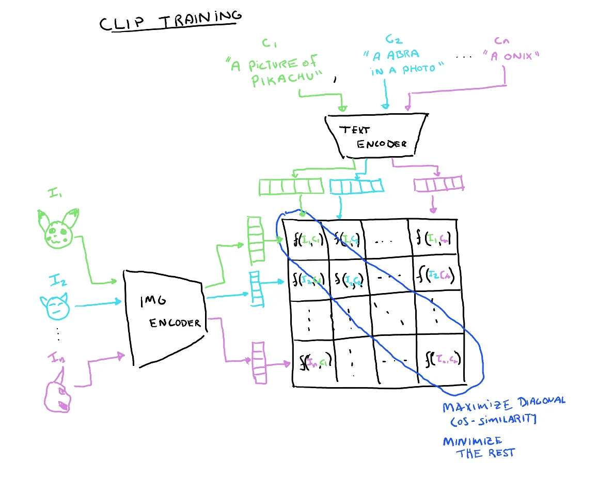
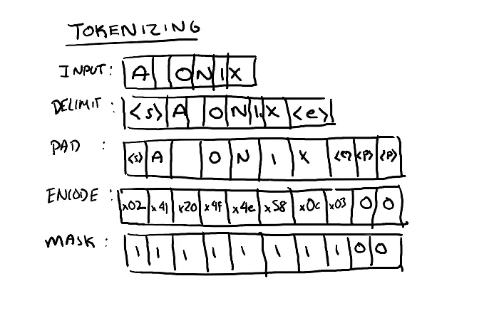
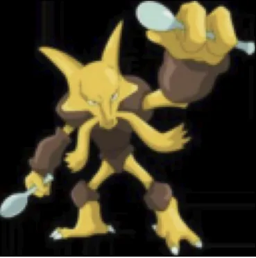
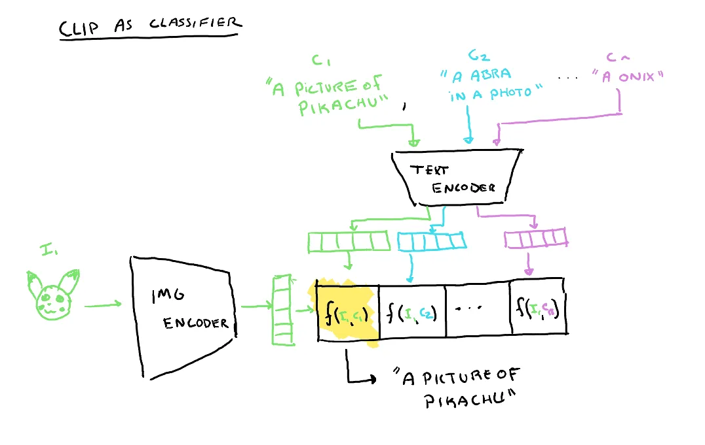
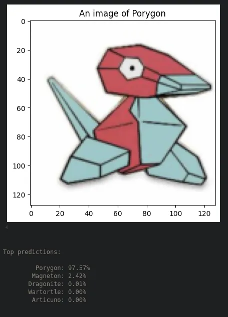

+++
title = "Building CLIP from Scratch to Classify Pokemon"
description = "Learning about how Contrastive Language-Image Pre-training (CLIP) works"

[taxonomies]
tags = ["cv", "ai", "transformers"]
+++

# Building CLIP from Scratch to Classify Pokemon

Prior deep learning approaches to performing image classification frame the problem as given a
dataset of image, label pairs, learn a mapping between the image space and the label space using
a neural network (MLP, CNN, etc.). Here the image space is typically a CxHxW dimensional space
where C is the number of channels, H and W are the height and width of the input image. Labels
may have semantic meaning to us as humans, but are presented to the model simply as one-hot
encoded vectors in a fixed sized N-D space where N is the number of possible different labels
that can be seen in the dataset. Each dimension of the label space is assigned a distinct
possible label, and the models output in that any particular dimension represents the models
confidence that the image is of that class. Extremely good performance on classification tasks
can be achieved using this problem framing and a good choice of model architecture. However,
this framing has drawbacks when trying to move out of narrow independent and identically
distributed settings, such as classification of images that are of a class not seen before
or dealing with slightly differently formed labels. In such cases, the model is unaware of
the existence of anything other than the N classes it was designed to decide between. Even
if it was, it would not be able to represent a novel class due to its fixed sized output and
the assigned semantic meanings to each dimension.

More recently, self-supervised methods have emerged which use simple scalable training tasks
to create models that can easily be repurposed for a number of different tasks. Many of these
methods avoid the use fixed sized label spaces instead looking to embed representations of
different modalities of data in a common embedding space. Distance in this embedding space
represents “sameness”. These models look to therefore project tuples of related data into the
same area in embedding space. Unseen labels or classes can be projected into this embedding
space just as easily as seen data, so even if the model has not seen that exact label before,
it its embedding should be close to similar seen labels and consequently their corresponding images.

One of these methods is Contrastive Language-Image Pre-training (CLIP). CLIP looks to take image
and text pairs such as captions for an image or alt-text and estimate how related they are by
this projection into a common embedding space. As opposed to “traditional” classification approaches,
CLIP is not attempting to solve the classification problem directly. It instead looks to maximize
the cosine similarity between correct image text pairs in the joint embedding space and minimize
the similarity between incorrect pairs. CLIP can then be repurposed for classification by giving
the model the choice between a number of potential captions (or labels) for an unseen image. The
caption with the highest cosine similarity can be considered the class, leading to what is known
“open world” object recognition. In this tutorial, we will learn how to create our own CLIP model
and use it to classify images of Pokemon.

## The CLIP Model

The CLIP model consists of a text encoder and an image encoder. Since the ultimate goal is to be
able pair image embeddings with their corresponding text embeddings, these two models are trained
together to maximize the pairwise cosine similarities between corresponding image and text embeddings
and conversely minimize the cosine similarity between image and text embeddings from different pairs.

```py
class CLIP(nn.Module):
    def __init__(self, emb_dim, vit_width, img_size, patch_size, n_channels, vit_layers, vit_heads, vocab_size, text_width, max_seq_length, text_heads, text_layers):
        super().__init__()

        self.image_encoder = ImageEncoder(vit_width, img_size, patch_size, n_channels, vit_layers, vit_heads, emb_dim)

        self.text_encoder = TextEncoder(vocab_size, text_width, max_seq_length, text_heads, text_layers, emb_dim)

        self.temperature = nn.Parameter(torch.ones([]) * np.log(1 / 0.07))

        self.device = torch.device("cuda" if torch.cuda.is_available() else "cpu")


    def forward(self,image,text, mask=None):
        I_e = self.image_encoder(image)
        T_e = self.text_encoder(text, mask=mask)

        # scaled pairwise cosine similarities [n, n]
        logits = (I_e @ T_e.transpose(-2,-1)) * torch.exp(self.temperature)

        # symmetric loss function
        labels = torch.arange(logits.shape[0]).to(self.device)

        loss_i = nn.functional.cross_entropy(logits.transpose(-2,-1), labels)
        loss_t = nn.functional.cross_entropy(logits, labels)

        loss = (loss_i + loss_t) / 2

        return loss
```

If you don’t know what text or image encoders are, you might want to follow a more bottom-up CLIP
tutorial that first develops these concepts: https://medium.com/correll-lab/building-clip-from-scratch-68f6e42d35f4

### Text Encoder

For the text encoder in CLIP we use the standard transformer architecture. However we want to embed
features in the joint vision-text embedding space. Therefore we have an extra set of parameters
`nn.Parameter(torch.randn(width, emb_dim))`. In the forward function, the text features are
embedded in the joint space by getting the dot product of the features and the learned
projection divided by the normalized dot product.

```py
class TextEncoder(nn.Module):
    def __init__(self, vocab_size, width, max_seq_length, n_heads, n_layers, emb_dim):
        super().__init__()

        self.max_seq_length = max_seq_length  # Maximum length of input sequence

        self.encoder_embedding = nn.Embedding(vocab_size, width) # Embedding Table

        self.positional_embedding = PositionalEmbedding(width, max_seq_length)

        self.encoder = nn.ModuleList([TransformerEncoder(width,n_heads) for _ in range(n_layers)])

        # learned proj of image to embed
        self.projection = nn.Parameter(torch.randn(width, emb_dim))

    def forward(self, text, mask=None):
        # Text Embedding
        x = self.encoder_embedding(text)

        # Positional Embedding
        x = self.positional_embedding(x)

        # Transformer Encoder
        for encoder_layer in self.encoder:
            x = encoder_layer(x, mask=mask)

        # Takes features from the EOT Embedding
        x = x[torch.arange(text.shape[0]),torch.sub(torch.sum(mask[:,0],dim=1),1)]

        # joint multimodal embedding
        if self.projection is not None:
            x = x @ self.projection

        x = x / torch.norm(x, dim=-1, keepdim=True)

        return x
```

### Image Encoder

For the image encoder we use the standard vision transformer architecture. Similar to the text encoder,
we have an extra set of parameters `nn.Parameter(torch.randn(width, emb_dim))`, the forward function
will embed the image features in the joint embedding space by taking the dot product of the features
and the learned projection divided by the normalized dot product.

```py
class ImageEncoder(nn.Module):
    def __init__(self, width, img_size, patch_size, n_channels, n_layers, n_heads, emb_dim):
        super().__init__()

        assert img_size[0] % patch_size[0] == 0 and img_size[1] % patch_size[1] == 0, "img_size dimensions must be divisible by patch_size dimensions"
        assert width % n_heads == 0, "width must be divisible by n_heads"

        self.n_patches = (img_size[0] * img_size[1]) // (patch_size[0] * patch_size[1])

        self.max_seq_length = self.n_patches + 1

        # Patch Embedding
        self.linear_project = nn.Conv2d(n_channels, width, kernel_size=patch_size, stride=patch_size)

        # Classification Token
        self.cls_token = nn.Parameter(torch.randn(1, 1, width))

        self.positional_embedding = PositionalEmbedding(width,self.max_seq_length)

        self.encoder = nn.ModuleList([TransformerEncoder(width,n_heads) for _ in range(n_layers)])

        # learned proj of image to embed
        self.projection = nn.Parameter(torch.randn(width, emb_dim))


    def forward(self,x):
        # Patch Embedding
        x = self.linear_project(x)
        x = x.flatten(2).transpose(1, 2)

        # Positional Embedding
        x = torch.cat((self.cls_token.expand(x.size()[0], -1, -1),x), dim=1)
        x = self.positional_embedding(x)

        # Transformer Encoder
        for encoder_layer in self.encoder:
            x = encoder_layer(x)

        # Takes Class Tokens
        x = x[:, 0, :]

        # joint multimodal embedding
        if self.projection is not None:
            x = x @ self.projection

        x = x / torch.norm(x, dim=-1, keepdim=True)

        return x
```

### Training



The training process consists of providing image, caption pairs from the dataset. CLIP uses contrastive
loss to train the model. Since we are looking to maximize the scaled pairwise cosine similarities
between the image and text embeddings along the diagonal where the text and image embeddings are correctly
paired, we can use cross entropy loss across the rows and columns with psuedo-labels corresponding to the
index of the embedding. This is the same as evaluating $n$ distinct text -> image estimates
and $n$ image -> text estimates concurrently. The model loss is the mean loss between the text and
image cross entropy loss.

```py
labels = torch.arange(logits.shape[0]).to(self.device)
# Label for row/column i is i (i.e. the index of the correct other half of the pair)

loss_i = nn.functional.cross_entropy(logits.transpose(-2,-1), labels)
loss_t = nn.functional.cross_entropy(logits, labels)

loss = (loss_i + loss_t) / 2
```

### Dataset

For this tutorial we will use [Faith Aykon](https://huggingface.co/fcakyon)'s
[Mini-Pokemon dataset](https://huggingface.co/datasets/fcakyon/pokemon-classification), hosted on HuggingFace
(this requires `datasets==2.21.0`).

This dataset consists of 280 examples in a 210/70 train/test split. The full dataset has 7000 images but as
such takes much longer to train, though the code can be trivially modified to use the full dataset

We will perform a number of modifications to this dataset to make it more suitable to training for CLIP.

```py
from torchvision.transforms import v2
class Pokemon(Dataset):
    def __init__(self, train=True):

        # Download the dataset from HuggingFace, use the mini split (change "mini" to "full" for the full dataset)
        self.dataset = load_dataset("fcakyon/pokemon-classification", "mini", trust_remote_code=True)

        # Image preprocessing
        self.transform = v2.Compose([
            v2.Resize((128, 128)),
            v2.ToTensor()
        ])

        if train:
            self.split = "train"
        else:
            self.split = "test"


        self.label_names = self.dataset[self.split].features["labels"].names

        self.caption_options = ["An image of {0}",
                                "A {0}",
                                "A photo of {0}",
                                "A {0} in a photo",
                                "A picture of {0}",
                                "A {0} image"]

        self.captions = {
            i: f"An image of a {l}" for i, l in enumerate(self.label_names)
        }
        self.labels = {
            i : l for i,l in enumerate(self.label_names)
        }

    def __len__(self):
        return self.dataset.num_rows[self.split]

    def __getitem__(self,i):
        img = self.dataset[self.split][i]["image"]
        img = self.transform(img)

        caption_template = np.random.choice(self.caption_options)
        caption_text = caption_template.format(self.labels[self.dataset[self.split][i]["labels"]])
        cap, mask = tokenizer(caption_text)

        mask = mask.repeat(len(mask),1)

        return {"image": img, "caption": cap, "mask": mask, "text": caption_text, "label": self.dataset[self.split][i]["labels"]}
```

#### Image Preprocessing

We define a transformation pipeline which gets applied to each image using

```py
self.transform = v2.Compose([
    v2.Resize((128, 128)),
    v2.ToTensor()
])
```

There is not too much data augmentation needed for simple cases, therefore we just resize the input image to a reasonable size.

#### Text Preprocessing

The original dataset is set up for more traditional classification approaches, i.e. some class label for each image which is an `int`
representing the index of the 1 in a one-hot encoded form of the label. Since CLIP uses text and not one-hot encoded vectors for the
“labels”, we need to generate them. The critical information is the type of Pokemon in the image. However, there are many ways in
natural language to convey the same information and we want to be robust to phrasing as it will help our classifier be more
robust later on.

Therefore, we include a number of caption templates that phrase the label in many semantically similar ways. When retrieving
a new image, a label pair is pulled from the dataset, this code will choose one of the caption templates to create a caption
containing the label text.

```py
class Pokemon():
  def __init(self, ...):
    ...
    self.caption_options = ["An image of {0}",
                            "A {0}",
                            "A photo of {0}",
                            "A {0} in a photo",
                            "A picture of {0}",
                            "A {0} image"]

  def __getitem__(self, i):
    ...
    caption_template = rng.choice(self.caption_options)
    caption_text = caption_template.format(self.labels[self.dataset[self.split][i]["labels"]])

```

#### Tokenization



Transformer models do not work directly on text, instead they use a numerical representation of characters (tokens). In this example
we use a trivial tokenization scheme UTF-8.

With the UTF-8 encoding the max vocabulary size is 256 since we are direct mapping from characters. For larger desired context sizes,
other tokenization schemes with greater vocabulary sizes may be desired.

The tokenizer delimits the input string with start and end tokens, reserved values that denote the limits of the input. Since the
input to the transformer is fixed size, the input tensor is padded to the full width of the input. Finally a mask is created to denote
that padded inputs should be ignored.

```py
def tokenizer(text, encode=True, mask=None, max_seq_length=32):
    if encode:
        out = chr(2) + text + chr(3) # Adding SOT and EOT tokens
        out = out + "".join([chr(0) for _ in range(max_seq_length-len(out))]) # Adding Padding
        out = torch.IntTensor(list(out.encode("utf-8"))) # Encoding Text
        mask = torch.ones(len(out.nonzero()))
        mask = torch.cat((mask,torch.zeros(max_seq_length-len(mask)))).type(torch.IntTensor)
    else:
        out = [chr(x) for x in text[1:len(mask.nonzero())-1]]
        out = "".join(out)
        mask = None

    return out, mask
```

These tokenzied forms of the captions are pre-calculated as part of the dataset.

```py
cap, mask = tokenizer(caption_text)
```

Since the mask will be applied to the attention scores ($max_seq_len x max_seq_len$), it needs to be repeated to be applied to each row.

```py
mask = mask.repeat(len(mask),1)
```

Therefore for each entry in the dataset we have the following information

```py
{"image": img, "caption": cap, "mask": mask, "text": caption_text, "label": self.dataset[self.split][i]["labels"]}
```

##### Example



```py
image.shape: torch.Size([3, 128, 128])
caption.shape: torch.Size([32])
mask.shape: torch.Size([32, 32])
text: "A Alakazam image"
caption(tokenized): tensor([ 2, 65, 32, 112, 104, 111, 116, 111, 32, 111, 102, 32, 65, 108,
97, 107, 97, 122, 97, 109, 3, 0, 0, 0, 0, 0, 0, 0,
0, 0, 0, 0], dtype=torch.int32)
mask: tensor([[1, 1, 1, …, 0, 0, 0],
[1, 1, 1, …, 0, 0, 0],
[1, 1, 1, …, 0, 0, 0],
…,
[1, 1, 1, …, 0, 0, 0],
[1, 1, 1, …, 0, 0, 0],
[1, 1, 1, …, 0, 0, 0]], dtype=torch.int32)
```

#### Hyperparameters

These are the parameters I used for training on a 3080Ti. The notebook contains these parameters and the seed I used.
Some modifications to the batch size might be needed if training on smaller GPUs.

```py
emb_dim = 32
vit_width = 9
img_size = (128,128)
patch_size = (64,64)
n_channels = 3
vit_layers = 3
vit_heads = 3
vocab_size = 256
text_width = 32
max_seq_length = 32
text_heads = 8
text_layers = 4
lr = 1e-3
epochs = 1500
batch_size = 1024
```

#### Training Loop

```py
device = torch.device("cuda" if torch.cuda.is_available() else "cpu")
print("Using device: ", device, f"({torch.cuda.get_device_name(device)})" if torch.cuda.is_available() else "")

model = CLIP(emb_dim, vit_width, img_size, patch_size, n_channels, vit_layers, vit_heads, vocab_size, text_width, max_seq_length, text_heads, text_layers).to(device)

optimizer = optim.Adam(model.parameters(), lr=lr)

best_loss = np.inf
for epoch in range(epochs):
    for i, data in enumerate(train_loader, 0):
        img, cap, mask = data["image"].to(device), data["caption"].to(device), data["mask"].to(device)
        loss = model(img,cap,mask)
        optimizer.zero_grad()
        loss.backward()
        optimizer.step()

    # Saves model if it performed better than the previous best
    print(f"Epoch [{epoch+1}/{epochs}], Batch Loss: {loss.item():.3f}")
    if loss.item() <= best_loss:
        best_loss = loss.item()
        torch.save(model.state_dict(), "clip_pokemon4.pt")
        print("Model Saved.")
```

### Testing Performance



We can evaluate how well our model is at associating image text pairs. We start by creating a spanning set of captions
for the different possible labels using one a slightly different caption form from those seen in training (ex. ”An
image of a Pikachu”). This was actually done as part of the dataset construction:

```py
self.captions = {
  i: f"An image of a {l}" for i, l in enumerate(self.label_names)
}
```

Each of these potential captions is tokenzied using the tokenizer and fed to the text encoder and a batch of images from the
test set are fed into the image encoder.

We then calculate the cosine similarity between the text and image embeddings and run softmax to get probabilities that any
particular label is the best pairing for a particular image.

We can then match these predicted captions with the true label to determine if the model was correct or not.

```py
# Loading Best Model
model = CLIP(emb_dim, vit_width, img_size, patch_size, n_channels, vit_layers, vit_heads, vocab_size, text_width, max_seq_length, text_heads, text_layers).to(device)
model.load_state_dict(torch.load("clip_pokemon4.pt", map_location=device))

# Getting dataset captions to compare images to
text = torch.stack([tokenizer(x)[0] for x in test_set.captions.values()]).to(device)
mask = torch.stack([tokenizer(x)[1] for x in test_set.captions.values()])
mask = mask.repeat(1,len(mask[0])).reshape(len(mask),len(mask[0]),len(mask[0])).to(device)

correct, total = 0,0
with torch.no_grad():
    for data in test_loader:
        images, labels  = data["image"].to(device), data["label"].to(device)
        image_features = model.image_encoder(images)
        text_features = model.text_encoder(text, mask=mask)

        image_features /= image_features.norm(dim=-1, keepdim=True)
        text_features /= text_features.norm(dim=-1, keepdim=True)
        similarity = (100.0 * (image_features @ text_features.T)).softmax(dim=-1)
        _, indices = torch.max(similarity,1)

        correct += torch.sum(indices==labels)
        total += len(labels)

print(f'\nModel Accuracy: {100 * correct // total} %')
```

Using my training settings and seed, I was able to achieve 87% accuracy on the Pokemon-mini dataset. This is not really representative for C
LIP’s power, as the dataset we have used for training here is very small. Using a CNN would actually be the preferred approach
here. Yet, for very large datasets CLIP has outperformed previous CNN model.

### Zero-shot Classification



We can reuse our CLIP model to perform the classification task now. First we generate a list of possible labels. These will just be names of
different types of Pokemon found in the dataset (ex. ”Pikachu”). We then tokenize each potential label and feed them to the text encoder. We
also feed an unlabeled image to the image label. The CLIP model will return the similarities between each potential label and the image based
on the training it had seen before. Note that we never just provide the label alone as a text pairing during training, but we do provide
various different captions which all share the label word within them. This demonstrates how, because of our pre-training, we are robust to
unseen label forms and yet can correctly associate the image with the correct label.

```py
# Loading Best Model
model = CLIP(emb_dim, vit_width, img_size, patch_size, n_channels, vit_layers, vit_heads, vocab_size, text_width, max_seq_length, text_heads, text_layers).to(device)
model.load_state_dict(torch.load("clip_pokemon4.pt", map_location=device))


# Captions to compare images to
class_names = test_set.label_names
class_text = [f"{l}" for l in class_names]

text = torch.stack([tokenizer(x)[0] for x in class_text]).to(device)
mask = torch.stack([tokenizer(x)[1] for x in class_text])
mask = mask.repeat(1,len(mask[0])).reshape(len(mask),len(mask[0]),len(mask[0])).to(device)

idx = 12

img = test_set[idx]["image"][None,:]
plt.imshow(  img[0].permute(1, 2, 0),)
plt.title(test_set[idx]["text"])
plt.show()
img = img.to(device)
with torch.no_grad():
  image_features = model.image_encoder(img)
  text_features = model.text_encoder(text, mask=mask)


image_features /= image_features.norm(dim=-1, keepdim=True)
text_features /= text_features.norm(dim=-1, keepdim=True)
similarity = (100.0 * image_features @ text_features.T).softmax(dim=-1)
values, indices = similarity[0].topk(5)

# Print the result
print("\nTop predictions:\n")
for value, index in zip(values, indices):
    print(f"{class_names[int(index)]:>16s}: {100 * value.item():.2f}%")
```

You can find a notebook with the code from this tutorial [here](https://colab.research.google.com/drive/1tOJDnSeScGTDATwWXxCF9jL8X_V9m9B2)
