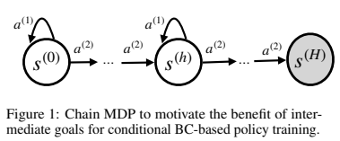
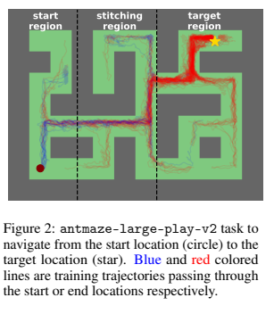
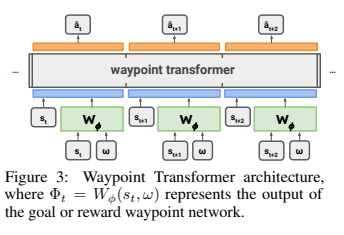
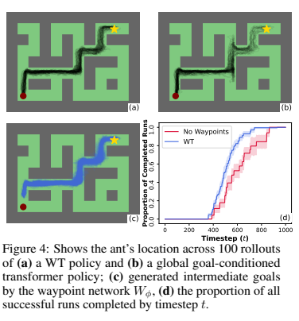

+++
title = "Understanding the Waypoint Transformer"
description = "Supervised goal conditioned reinforcement learning using generated intermediate goals."

[taxonomies]
tags = ["rl", "ai", "transformers"]
+++

# Waypoint Transformer

The [Waypoint Transformer](https://openreview.net/pdf?id=BYywOFbRFz) was published at NeuRIPS 2023 by Badrinath et. al. and is a new method for Reinforcement learning via supervised learning (RvS) that builds on the prior [Decision Transformer](https://arxiv.org/abs/2106.01345) and is conditioned on automatically generated waypoints.

### Online vs Offline Reinforcement Learning

In reinforcement learning, the agent learns to interact with an environment by taking actions and observing the results. The agent's goal is to maximize the cumulative reward it receives over time. The agent learns by trial and error, exploring the environment and learning from its experiences. There are two large classes of approach to reinforcement learning: online and offline. Online reinforcement learning interacts with the environment in real-time, while offline reinforcement learning learns from collected prior experiences interacting with the environment.

### Supervised Reinforcement Learning (RvS)

Value-based offline methods tend to attempt to learn a pessimistic value estimate for different states in the state space or state action pairs. This is used to estimate the expected return of a policy. Alternatively, model-based offline RL methods estimate the dynamics of the environment and use it to plan. Typically, complex hyperparameter tuning is required to achieve stable learning.

Reinforcement learning via supervised learning (RvS), builds off behavioral cloning as a simple alternative to traditional offline RL. This removes the need for Temporal Difference (TD) learning and value functions and allows offline RL to reuse methods from supervised learning. Typically, the conditioning variable for the policy is based off the return, goal-conditioning, or inverse reinforcement learning,

RvS has historically struggled in tasks where the agent must combine multiple sub-optimal training trajectories to achieve a goal. The Waypoint Transformer paper points to two notable examples: reaching specific locations in AntMaze and completing a series of tasks in FrankaKitchen. Here, prior TD methods such as Implicit Q-learning outperform RvS methods.

## Waypoint Transformer

The Waypoint Transformer introduces a method for generating intermediate goals and more stable proxy rewards that guide the policy towards objectives. Then they use a transformer based RvS method on the generated sub-goals to obtain a policy that learns to follow the waypoints improving performance and stability vs other offline RL methods.

### Setting

Using the Markov Decision Process (MDP) setting, with states $s_t \in \mathcal{S}$, $a_t \in \mathcal{A}$, unknown dynamics $p(s_{t+1} | s_t, a_t)$ and initial state distribution $p(s_0)$, the agent chooses an action $a_t \sim \pi_{\theta}(a_t | s_{t-k..t}, \Phi_{t-k..t})$, parameterized by $\theta$ and conditioned on a known history of states $s_{t-k..t}$ and a conditioning variable $\Phi_{t-k..t}$ that could encode goals or rewards based on a target global outcome $\omega$.

This is distinct from the traditional RL setting where the policy is modeled on $\pi(a_t | s_t)$, as the policy is modeled using a transformer which accepts the past states in a fixed sized context window $k$. The choice of $\omega$ during training is sampled from data. At test time, it is assumed that $\omega$ can be generated or provided by global goal information for a goal-conditioned variant or simply a target reward in the reward-conditioned variant.

### Waypoints

In offline RL, data typically does not encompass all possible cases that an agent may want to achieve in testing. Consider a infinite dataset $\mathcal{D}$ that is collected by a random behavior policy $\pi_{b}(a_t|s_t)$. When looking to achieve a goal $\omega = s^{(H)}$, the random policy will be suboptimal since actions are selected at random. Then when using a goal conditioned policy $\pi_{G}(a_t|s_t,\omega)$ that is trained using demonstrations from $\mathcal{D}$, the policy will also be suboptimal since $\omega$ is fixed, so $\forall s \in \mathcal{S},$ $\pi_{G}(a_t|s_t,\omega) = \pi_{b}(a_t|s_t)$. So a global goal-conditioned policy cannot be any better than the random behavior policy it was trained on.

Instead consider a policy that uses intermediate goals $\pi_{W}(a_t|s_t, \Phi_t)$, $\Phi_t = s_{t+k}$. The paper shows that the probability of choosing an optimal action is higher compared to the longer-horizon goal conditioned policy. $\Phi_t$ also serves as a guide as it guides the policy towards strong intermediate targets to reach the global goal. As long as the selected waypoints are strong ones that lead towards the goal $\omega$, the expectation on policy will be more optimal than behavior cloning.

#### Stitching Waypoints

The ability to compose sequences of otherwise suboptimal trajectories requires finding experiences that are more relevant to achieving subgoals vs the overall goal. The paper uses AntMaze to demonstrate this. They find that only 5% of trajectories using a _random policy_ (this is unclear in the paper) would demonstrate how to cross between a start region and the target region. It is therefore very unlikely to find a trajectory that goes from the start state to the goal state. The policy must stitch together trajectories that start at the start state with trajectories that end at the goal state. By providing waypoints in the stitching regions the policy can be guided to connect the relevant sub-sequences together.

### Generating Waypoints (Goal-conditioned RvS)

The paper uses a waypoint generator that makes $k$ step ahead predictions of future observations conditioned on $s_t$ and $\omega$. This is parameterized as a neural network that is trained on the same offline dataset $\mathcal{D}$ as the policy using MSE loss.

$$
arg\min_{\phi} \sum_{(s_t, \omega) \in \mathcal{D}} || W_{\phi}(s_t, \omega) - s_{t+k} ||^2_2
$$

By doing this you are learning which states $k$ steps ahead you want to visit to reach a goal $\omega$ and then use this to guide the policy. The assumption is that you will have a strong demonstration of the policies to cross $k$ steps from any particular state to other states $k$ steps away.

### Generating Proxy Rewards (Reward-conditioned RvS)

Prior methods use cumulative reward to-go (CRTG) - a dynamic estimate of the reward to go or average reward-to-go (ARTG) - a static estimate of the reward to go as proxy rewards for the policy. However, using these conditioning variables has drawbacks: the variance of cumulative reward-to-go is high and the bias of the average reward-to-go is high. Instead of using a learned value function like in TD methods, this paper adds a reward waypoint network to estimate both cumulative and average reward-to-go conditioned on $s_t$ and $\omega$ using $\mathcal{D}$. They claim that modeling both CRTG and ARTG addresses the high bias of ARTG and the high variance of CRTG in the same way that prior methods like [REINFORCE](https://link.springer.com/article/10.1007/BF00992696) do.

### Policy Transformer

The architecture for the waypoint transformer is based on GPT-2. The policy is conditioned on the past $k$ states and the waypoints (either the goals or rewards) $\Phi_{t - k..t}$ which are generated by the waypoint network. The policy transformer is trained using negative log likelihood loss based on data sampled from $\mathcal{D}$. During this process, the waypoint network is fixed. Unlike decision transformers, the waypoint transformer is not conditioned on past actions.

## Experiments

The proposed method is evaluated on two environments that come with many suboptimal demonstrations in the goal-conditioned case: AntMaze and FrankaKitchen. FrankaKitchen specifically has no end to end demonstrations available. For each of these environments, the paper uses goal conditioning where $\omega = s_{target}$ and constructs intermediate waypoints using the goal waypoint network. For reward-conditioned tasks they use Gym-MuJoCo. For a plurality of evaluated tasks, waypoint transformers outperform decision transformers and other offline RL methods. However there are some cases where TD still outperforms the waypoint transformer or that waypoint transformer simply matches the performance of behavior cloning.

The authors analyze the behavior of the waypoint transformer on AntMaze, they find that WT is much more effective at reaching the goal state than a globally conditioned policy and completes the task faster. When using $k = 30$ vs. $k = 0$, the performance is 2.2x worse.

On reward conditioned tasks the authors analyze the behavior of the waypoint transformer on Hopper-v2. They find that the standard deviation of CRTG grows slower than other methods. WT is also more robust to the choice of seed than other methods.

Interestingly in the appendix, they evaluated using manually selected waypoints and found that WT outperforms manual waypoints. However the manual waypoints are still better than no waypoints and the difference seems to come down to the density of waypoints selected. The manual waypoints are much coarser than the waypoints selected by the waypoint network.

### Why This Matters

The real usefulness of this method is to be able to collect a lot of partial demonstrations of relevant trajectories, then allow the waypoint network guide the policy to compose them together to achieve a goal in an environment with sparse rewards where traditional RL methods would struggle or would require much higher quality data. RvS is a compelling method for RL since it does not require learning a value function which is incredibly sensitive to initialization and requires a lot of data to learn. The issue with prior RvS methods is that they rely on the quality of the demonstrations to be able to learn a good policy. Behavior cloning and imitation learning methods alone are unable to utilize partial demonstrations as well, requiring demonstrations that fully explain how to achieve a goal. This makes data collection incredibly expensive and time consuming particularly when goal and start states are not fixed. Waypoint transformers demonstrate a method to learn from partial demonstrations and compose them together to achieve a goal. However, waypoint transformers are a method designed to handle degenerate cases. In cases where demonstrations are complete, waypoint transformers are not necessary and their performance will be similar to behavior cloning or decision transformers. This paper focuses on spatial composability and reward interpolation, it is unclear how well waypoint transformers are able to compose over other dimensions such as skill chaining.
